# 美食采集账本

本轮研究已停止，以下为已完成记录的汇总，尚未达到原定目标。其余五城一城一位调研负责人；240家为目标。芜湖半天出发中转，按用户要求暂停补采，保留已有早餐参考，不计目标。正文、图片和入口记录齐全才导入。推荐等级另按口碑、分店和营业证据判断，暂不推荐的记录不进入默认筛选。全部原图保留作者与水印；采集时为私人旅行参考，用户于2026-10-01确认公开展示，原作者再使用许可未建立。

- 青岛：22 / 60 家采集记录
- 威海：19 / 80 家采集记录
- 连云港：21 / 40 家采集记录
- 日照：18 / 40 家采集记录
- 芜湖：7 家出发早餐参考（暂停补采，无数量目标）
- 淮安：16 / 20 家采集记录

## 青岛 · 春和楼

等级：caution。总店同址当前营业、真实主帖正文评论作者与评论者主页和反搜齐，但独立负向服务/口味与主帖多负评，不用老字号情怀充默认推荐数。

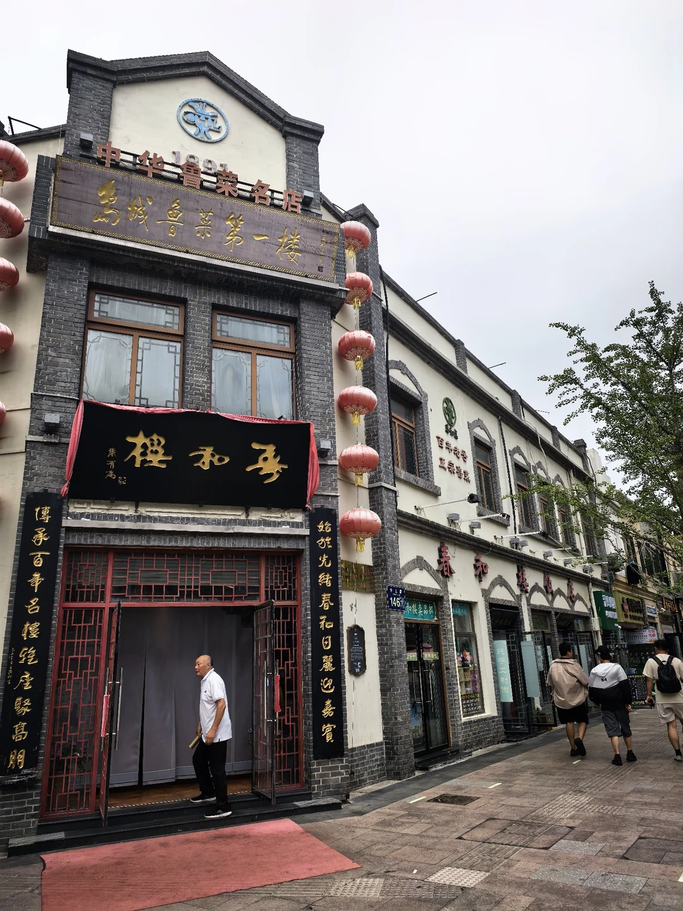

- 小红书：[青岛人们身在福中要知福啊。 · 绝不拖四个后代化的现腿](https://www.xiaohongshu.com/explore/688f82a900000000230347fe)。亲开无参数canonical当前笔记暂时无法浏览/App扫码；搜索正文正常，非账户验证。
- 点评：[具体门店](https://www.dianping.com/shop/554230)。Chrome完整同店头部与默认3评
- 高德：[地点](https://www.amap.com/place/B0LGV4SLXX)。Chrome真实公开place亲开完整同址
- 图像原文件 SHA256：ce8713dbf68cb025323c2d8d83e4dabc88d5706ceb8ccffa864d467247d1f2ac，1080×1440。原图为春和楼外立面，店名字样与中山路146号蓝门牌可见；这是门店照片，不是菜品照片。

## 青岛 · 邓记一品生煎

等级：optional。普通游客正文实拍、具体口味评论及两位账号核查齐，点评同分店当日营业；近期差评与本地账号证据不足，作为顺路可选。

- 小红书：[在青岛吃到了好吃的生煎 · 本人无名&](https://www.xiaohongshu.com/explore/6a4c8d0f000000000f0293af)。Chrome亲开无参数canonical显示当前笔记暂时无法浏览/请打开小红书App扫码查看；实际搜索详情正文可读。
- 点评：[具体门店](https://www.dianping.com/shop/H3MN6f5Mw6UkQryp)。青岛站具体分店搜索取得实际链接后Chrome亲开头部与推荐菜可读。
- 高德：[搜索备选](https://www.amap.com/search?query=%E9%9D%92%E5%B2%9B%20%E9%82%93%E8%AE%B0%E4%B8%80%E5%93%81%E7%94%9F%E7%85%8E%20%E4%B8%AD%E5%B1%B1%E8%B7%AF129%E5%8F%B7)。Chrome亲开精确检索并点击同名结果；地图标注匹配，未取得place直链。
- 图像原文件 SHA256：881009cc7821937c9dac2e38e54648bcf415227cf53bb782a08984375ecf4cc0，1440×1080。root实看外卖盒内两排共六只黑芝麻生煎，盒盖压字一品生煎可见；与邓记具名中山路专帖外卖餐食描述相符，具体门店依据正文与点评同址，不凭食品外观单独证明。

## 青岛 · 付喜善·朝鲜面

等级：caution。明确台东86门头原图+09-20亲子消费正文，两平台现营业；反搜存在餐具套袋与服务实质争议，未独立证实安全但暂不进入默认推荐，不能为达标忽略风险。

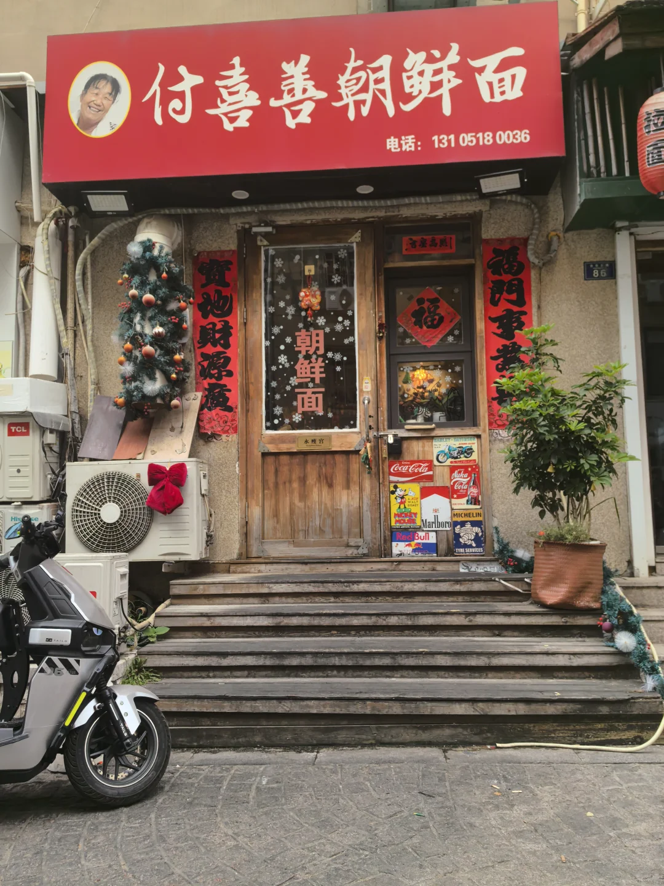

- 小红书：[台东的付喜善朝鲜面 · 煊宝](https://www.xiaohongshu.com/explore/6aaf43b3000000000d0240f3)。Chrome亲开无参数canonical App扫码读限制，搜索详情正文/静态门头正常。
- 点评：[具体门店](https://www.dianping.com/shop/G7GIG3SkioxWJHyl)。Chrome亲开同分店头部+默认3评论
- 高德：[地点](https://www.amap.com/place/B0J1XZO1OJ)。Chrome亲开同店完整可读
- 图像原文件 SHA256：f32dfd4d6919e91bd2fd87eb23470219f0f0e32d6bd4deceb753a61422572d89，1080×1440。红底付喜善朝鲜面门头、86号门牌及13105180036电话可见，与记录对应。

## 青岛 · 海萍馄饨

等级：optional。精确湖北店正文/原图及点评当前营业、高德位置齐；适合顺路，来源与差评证据有限，不评必去。

- 小红书：[青岛｜中山路老牌馄饨铺子（附菜单） · 环游世界的胃](https://www.xiaohongshu.com/explore/6a95854f000000002103377c)。Chrome无参数explore亲开web_error_page；站内签名搜索入口正文可读
- 点评：[具体门店](https://www.dianping.com/shop/H5sDWwMjVI2BzjQs)。Chrome亲开4.1/1807/¥22，营业中07–21，湖北河南路西北角百盛西侧
- 高德：[搜索备选](https://www.amap.com/search?query=%E9%9D%92%E5%B2%9B%20%E6%B5%B7%E8%90%8D%E9%A6%84%E9%A5%A8%20%E6%B9%96%E5%8C%97%E8%B7%AF)。Chrome实搜匹配海萍湖北路店
- 图像原文件 SHA256：69fd0bb565eb16aece0faa4d4fa0203dc8a9d5269aa030f3b83e2e1976280f6d，1080×1440。本地原图为汤碗中勺子夹起一只大馄饨，背景多只馄饨，作者封面字样；同note正文明确湖北路分店。

## 青岛 · 海燕奶奶

等级：caution。门店营业和地址已核实，海鲜锅贴有特色，但价格油腻争议及探店账号风险较高。

- 小红书：[青岛台东真正低调的真神 · 小祁吃点啥](https://www.xiaohongshu.com/explore/6a705e860000000021022c98)。单独打开无参数canonical，显示当前笔记暂时无法浏览，错误300031；签名搜索进入可读。
- 点评：[具体门店](https://www.dianping.com/shop/EWyvSfNaBoJxf4uy)。Chrome实际打开门店页：4.3，4505条评价，¥32/人，营业中08:00-22:00
- 高德：[搜索备选](https://ditu.amap.com/search?query=%E9%9D%92%E5%B2%9B%E6%B5%B7%E7%87%95%E5%A5%B6%E5%A5%B6%E5%8F%B0%E4%B8%9C)。Chrome实际打开并加载搜索结果，匹配台东店
- 图像原文件 SHA256：213018d688b0ca9eb5586a59580b85b8aabf2cc055be2d7d30ba03a4a290efce，1080×1440。主图显示多种海鲜锅贴，与正文大虾、笔管、墨鱼、海胆内容对应

## 青岛 · 好美味砂锅馄饨馆

等级：optional。主帖标题明确上清路、食物原图及具体优缺点，点评4.3同分店当前营业；反搜有真实争议但主要口味及服务个人体验，仅限定皮蛋混合顺路尝，不列必去。

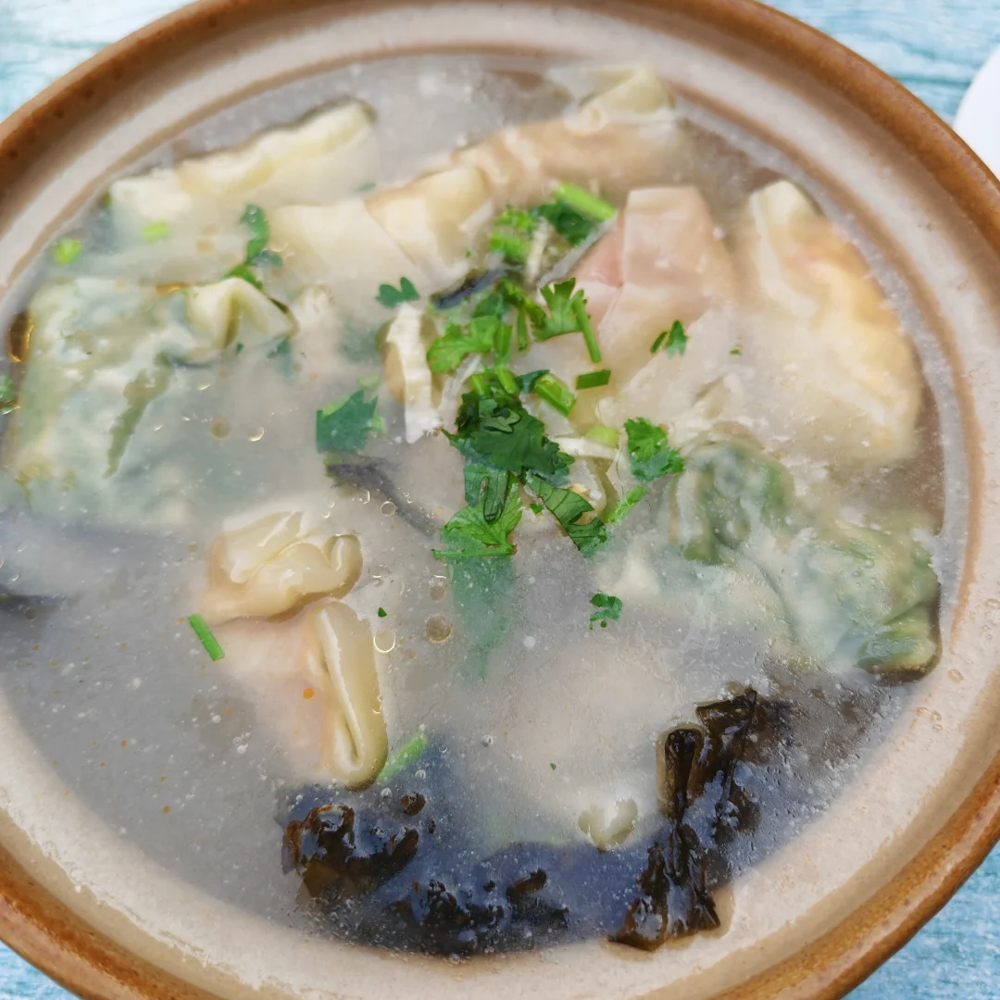

- 小红书：[青岛｜好美味砂锅馄饨馆(上清路店) · 今天吃咩啊](https://www.xiaohongshu.com/explore/68dbcfbb000000000402a0d1)。Chrome亲开无参数canonical显示暂时无法浏览/请打开App扫码；搜索详情图文正常。
- 点评：[具体门店](https://www.dianping.com/shop/G1GYGoVVsiNq7xdV)。Chrome亲开头部推荐菜可读
- 高德：[地点](https://www.amap.com/place/B021405MW1)。Chrome亲开真实place链接，抱歉未能获取到该地点信息
- 图像原文件 SHA256：733677df9ea147e4239a01cf768826d034d968c07d3cfd2586a57f59156abd58，1080×1080。砂锅内有馄饨、紫菜和香菜，与同帖描述对应；店址依靠正文，未从食物图推断。

## 青岛 · 红宝石蛋糕店

等级：caution。独立正文与原图明确湖北路，普通作者主页及口味反驳评论核查齐，点评当日营业；普通食客口味失望与3.9评分使其不列默认推荐，保留情怀/口味偏好选项。

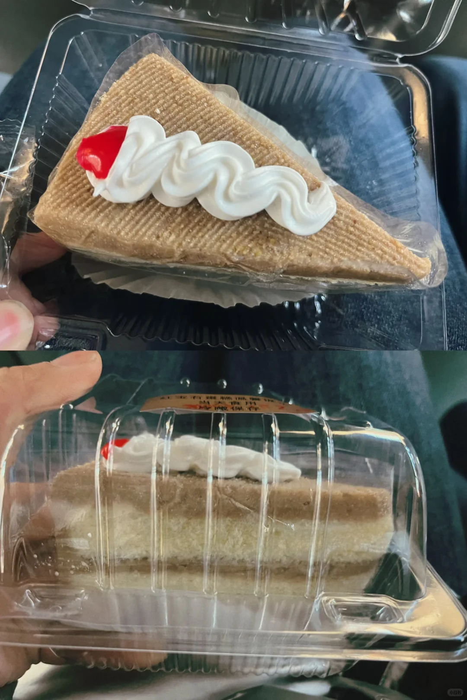

- 小红书：[青岛老字号红宝石 · 🐻兜兜里有糖🐻](https://www.xiaohongshu.com/explore/679b9a87000000002a00e70f)。本次Chrome无参数canonical单独打开显示当前笔记暂时无法浏览/请打开App扫码查看；搜索详情正文可读。
- 点评：[具体门店](https://www.dianping.com/shop/jmP2AoOq5mUT5o0p)。本次青岛具体湖北路搜索取得真实链接后Chrome亲开，头部推荐菜可读。
- 高德：[搜索备选](https://www.amap.com/ssr/search?query_type=TQUERY&query=%E9%9D%92%E5%B2%9B%E7%BA%A2%E5%AE%9D%E7%9F%B3%E8%9B%8B%E7%B3%95%E5%BA%97&city=330100&geoobj=119.806233%7C30.107939%7C120.684308%7C30.516621&zoom=11.1)。初次带空格查询误召回杭州，改用可见搜索框青岛红宝石蛋糕店后实际列湖北与徐州，点击湖北标注同址；无place直链。
- 图像原文件 SHA256：5956b0c7cea2d798b0a8a031eec4c749f3e9d3da51a03f835484da1ecec4dfe8，1080×1615。双视角栗子膏三角蛋糕，奶油和外卖盒；与记录中的栗子蛋糕对应，分店由原帖正文支持。

## 青岛 · 姐夫家

等级：caution。营业及地址已核实，但点评3.9，7月26日近三个月可见差评自述食材鲜度和性价比不佳；作者商业倾向与无评论使佐证有限。

- 小红书：[吃了30年的姐夫家，味道还是这么好 · 兵临城下](https://www.xiaohongshu.com/explore/69e35492000000001f004fb5)。native Chrome标签标题显示小红书-你访问的页面不见了；web open另实测不可达
- 点评：[具体门店](https://www.dianping.com/shop/G40Pks0F0u8RLngP)。Chrome亲开：3.9/1375条/¥70/人，营业中10:30–22:00，闽江路109丙
- 高德：[搜索备选](https://ditu.amap.com/search?query=%E9%9D%92%E5%B2%9B%20%E5%A7%90%E5%A4%AB%E5%AE%B6)。Chrome实际加载青岛搜索结果，匹配闽江路店
- 图像原文件 SHA256：a80d4532627bc3dbd264c7e578de9f31b28a16d3ec0a8fb6c425e65ac345ca7f，1080×1440。专帖第一张：米饭上辣椒五花肉，背景疙瘩汤，与正文菜品对应

## 青岛 · 金麦园快餐食品

等级：optional。精确正文原图与评论/账号核查齐，点评及高德当日同址显示营业；闭店冲突与差评范围不足，保留顺路可选。

- 小红书：[青岛老味道｜藏在老城40多年的金麦园 · 小小的念](https://www.xiaohongshu.com/explore/6a6ac06d000000001003c07d)。本次Chrome单独打开无参数canonical显示当前笔记暂时无法浏览/请打开小红书App扫码查看；搜索详情可读。
- 点评：[具体门店](https://www.dianping.com/shop/EszDnMLqL8OmDPkr)。Chrome原生青岛金麦园搜索结果取得真实链接后直接亲开，头部推荐菜可读。
- 高德：[地点](https://www.amap.com/place/B021401ADB)。Chrome实开后完整商户页可读。
- 图像原文件 SHA256：5b4eb1e57fb7c9d3475f713b89d9a163cf3531fe44046665115a917c834a31a9，960×1280。root实看手持咬开的白芝麻夹馅面包，内馅可见碎颗粒，符合具名金麦园专帖白芝麻花生面包描述；图片本身无店牌，分店依据正文安徽路18甲及点评/地图同址核验，非凭面包外观判分店。

## 青岛 · 老方子馅饼粥

等级：optional。普通青岛生活账号有多次消费语境，已核具体肉馅老客评论人主页、精确分店原图及点评当前营业/高德位置；限制主要是油腻与素馅口味偏好，可顺路早餐，近三个月差评未读，不能评必去。

- 小红书：[青岛早餐排队王——老方子馅饼粥 · 棍棍想要棍棍得到](https://www.xiaohongshu.com/explore/6a851bdc000000002500db8a)。Chrome亲开固定explore地址返回web_error_page，无正文；同日站内搜索签名入口正文完整可读
- 点评：[具体门店](https://www.dianping.com/shop/iDQsgJ0cZkcjDveJ)。Chrome亲开4.2/1959条/¥11，营业中05:30-14:00，四平路23甲
- 高德：[搜索备选](https://ditu.amap.com/search?query=%E9%9D%92%E5%B2%9B%20%E8%80%81%E6%96%B9%E5%AD%90%E9%A6%85%E9%A5%BC%E7%B2%A5%20%E5%9B%9B%E5%B9%B3%E8%B7%AF)。Chrome实际搜索匹配老方子馅饼粥台东店
- 图像原文件 SHA256：d3da54b5e68ae30a945341bbcbe05b32699fe08c1382ce2b62b9c6d13223090a，1080×1920。两只漏油网篮里的金黄炸馅饼，与专帖现炸馅饼描述匹配

## 青岛 · 老即墨路901炸串

等级：caution。具体台东正文原图作者/评论主页与点评现营业齐；口味腻、旧服务及食物温度指控未核，地图同址为另一店和品牌归属争议，保留慎去，绝不计推荐达标。

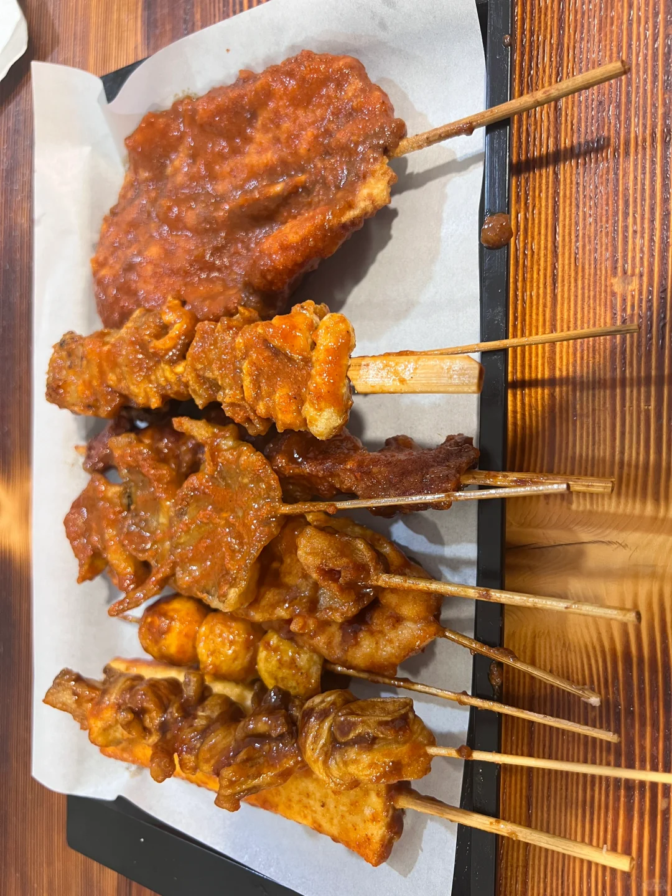

- 小红书：[青岛 ｜ 老即墨路炸串 原901炸串 · Z.](https://www.xiaohongshu.com/explore/67068081000000001a02041b)。Chrome亲开无参数canonical App扫码读限制，搜索详情正文原图评论正常。
- 点评：[具体门店](https://www.dianping.com/shop/jJK5gGoR4T92FDTF)。Chrome亲开同台东店头部与默认3评论
- 高德：[搜索备选](https://www.amap.com/search?query=%E9%9D%92%E5%B2%9B%E8%80%81%E5%8D%B3%E5%A2%A8%E8%B7%AF901%E7%82%B8%E4%B8%B2%E5%8F%B0%E4%B8%9C%E4%BA%8C%E8%B7%AF3%E5%8F%B7)。Chrome亲开精确搜索仅同址/福满馄饨结果
- 图像原文件 SHA256：af0e35984ba12381bbf6d3654934d2938387e15131b465c9947d73aedc0558fd，1080×1440。纸垫托盘上的裹面刷酱炸串，与具名原帖相符；图片不独立证明分店。

## 青岛 · 蔚道老李村脂渣

等级：optional。普通游客团岛具体正文、同店招牌商品实拍、完整作者及具体口感评论者主页核查，两平台地址一致，点评同分店当天营业。口味与新鲜范围不足，少量顺路试为限。

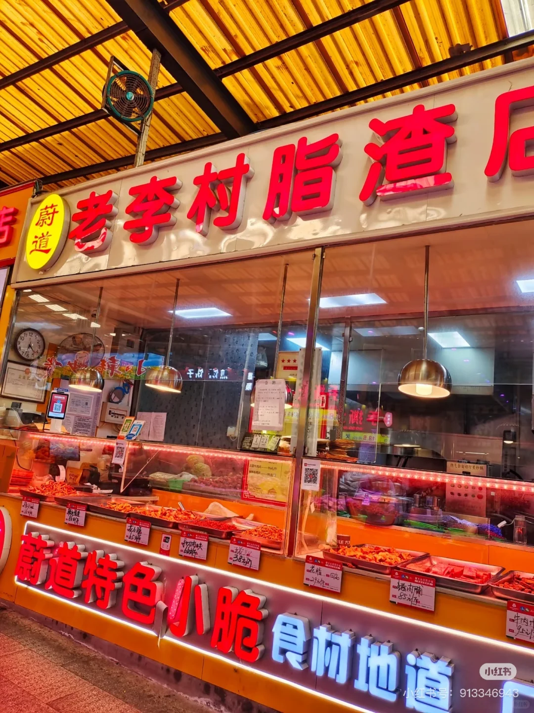

- 小红书：[有没有宝子帮忙代购一下团岛市场的蔚道脂渣 · 切丽切丽](https://www.xiaohongshu.com/explore/68dc86960000000007023c68)。Chrome亲开无参数链接显示暂时无法浏览/请打开App扫码，搜索详情正文图评论正常。
- 点评：[具体门店](https://www.dianping.com/shop/H9TrdAx2FBuJVTho)。Chrome亲开真实同分店头部推荐菜可读
- 高德：[搜索备选](https://www.amap.com/search?query=%E9%9D%92%E5%B2%9B%E8%94%9A%E9%81%93%E8%80%81%E6%9D%8E%E6%9D%91%E8%84%82%E6%B8%A3%E5%9B%A2%E5%B2%9B)。Chrome亲开精确检索，同店实际结果可读
- 图像原文件 SHA256：fdd0b5d4fbed49bd7116d514e1b829c82e6775d8afc1d345ccfadfb55523837d，1080×1440。蔚道老李村脂渣门头及商品柜，五花脆等实物、店名和原水印保留；2025价牌不当当前价。

## 青岛 · 连记海鲜馄饨

等级：caution。精确分店正文、食物原图、营业及地图已核；专业达人主帖，评论仅简单口味认可，品牌负面分店不明。

- 小红书：[美食真探NO.519~青岛：连记馄饨（小港店） · 闲不住的真探官](https://www.xiaohongshu.com/explore/6a366421000000002101b407)。Chrome亲开无参数explore为web_error_page，签名站内搜索入口全文和评论可读
- 点评：[具体门店](https://www.dianping.com/shop/98074948)。Chrome亲开4.2/673条/¥24，营业中06:00-21:00，新疆路8号
- 高德：[搜索备选](https://www.amap.com/search?query=%E9%9D%92%E5%B2%9B%20%E8%BF%9E%E8%AE%B0%E6%B5%B7%E9%B2%9C%E9%A6%84%E9%A5%A8%20%E8%87%AA%E7%94%B1%E6%B8%AF%E6%B9%BE)。Chrome实搜匹配连记海鲜馄饨自由港湾店
- 图像原文件 SHA256：45b04812ebb83a251b31dec1474ccc37134e78b498d6cb5251fe3d790c0cdddf，1080×1441。实际原图为蛋黄馄饨清汤，碗沿LIANJI，右下平台水印完整，与专帖正文对应。

## 青岛 · 劈柴院锅贴

等级：caution。精确沈阳路专帖、原食物和门头照片及点评营业齐；达人来源和简单评论佐证弱，点单规则/排队有不确定。

- 小红书：[美食真探NO.369~青岛：劈柴院锅贴沈阳路店 · 闲不住的真探官](https://www.xiaohongshu.com/explore/69acf57a000000001a01f5ba)。Chrome亲开固定explore显示当前笔记暂时无法浏览/App扫码；签名站内搜索入口正文可读
- 点评：[具体门店](https://www.dianping.com/shop/2384992)。Chrome亲开4.1/1628条/¥30，营业中07:30-21:00，沈阳路28
- 高德：[搜索备选](https://ditu.amap.com/search?query=%E9%9D%92%E5%B2%9B%20%E5%8A%88%E6%9F%B4%E9%99%A2%E9%94%85%E8%B4%B4%20%E6%B2%88%E9%98%B3%E8%B7%AF28)。Chrome实搜匹配劈柴院锅贴沈阳路店
- 图像原文件 SHA256：ce045941b8896b78f40c31a92772c7a2469aa769e1f098ef5f48ab9de6e3aec1，1080×1440。本地实际为四格锅贴实拍拼图：剖开虾仁/肉馅与一盘煎锅贴，盘子印劈柴院锅贴；同note另保存门头原图，与正文精确沈阳路分店关联。

## 青岛 · 生活林

等级：exclude。采集材料齐全但跨平台可读验证不足、营业未知，排除推荐；不冒用同名酒店信息。

- 小红书：[青岛生活林老式糕点店 · 喂鱼吃鱼🐟](https://www.xiaohongshu.com/explore/6ab34b810000000018005412)。Chrome单独实开canonical导航超时后读到当前笔记暂时无法浏览，请App扫码查看；签名入口继承证据可读
- 点评：[具体门店](https://www.dianping.com/shop/H55t8vyPu9A4hcxI)。Chrome青岛search实际得到河北路店直链及1175评价/¥34；导航直店时报标签不属session、重绑定native pipe关闭。评分营业未读；web另实际open直链工具不可访问
- 高德：[搜索备选](https://ditu.amap.com/search?query=%E9%9D%92%E5%B2%9B%E7%94%9F%E6%B4%BB%E6%9E%97%E6%B2%B3%E5%8C%97%E8%B7%AF)。2026-10-01 web实际打开合法搜索入口不可达；Chrome中断无法补native状态
- 图像原文件 SHA256：e64ce04127e65febc3fad3a7f563beeb190ae825a3bc0ff62976bf30062bf30b，1080×1420。店面照片明确生活林招牌及门牌8号，与正文/评论河北路8号相符。

## 青岛 · 十三不靠·球酥点心

等级：optional。专帖明确分店与实拍球酥，点评和高德同址当前均营业；品牌口味争议较大，先试少买、顺路可选，非必去。

- 小红书：[青岛，十三不靠 •球酥点心（台东昆明路店) · 维尼熊猫](https://www.xiaohongshu.com/explore/64c7208f000000000800cf8e)。本次Chrome单独打开无参数canonical显示当前笔记暂时无法浏览/请打开小红书App扫码查看；实际搜索详情读正文。
- 点评：[具体门店](https://www.dianping.com/shop/H9kukpsJPz4Lz6IJ)。青岛具体昆明路搜索取得实际链接，Chrome亲开。
- 高德：[地点](https://ditu.amap.com/place/B0FFFRUEH2)。Chrome亲开完整地点页。
- 图像原文件 SHA256：74bf788fc45b2780b68330281724516ab3ac73e3c7211bfc25710c8ecddd60c8，1440×1080。root实看食品柜台多排球酥，原品牌口味牌明确十三不靠、生椰拿铁、金沙芝士、榴莲乳酪、紫薯糯米；与台东昆明路店专帖相符，原标志与完整照片保留，图上2023旧价不当当前报价。

## 青岛 · 顺兴食品

等级：optional。主帖正文食物与同店门头原图、作者主页齐；补读台东口味对比与实际评论者个人主页，点评同店当日营业。以少量顺路试油酥面包为限，不泛化推荐全部。

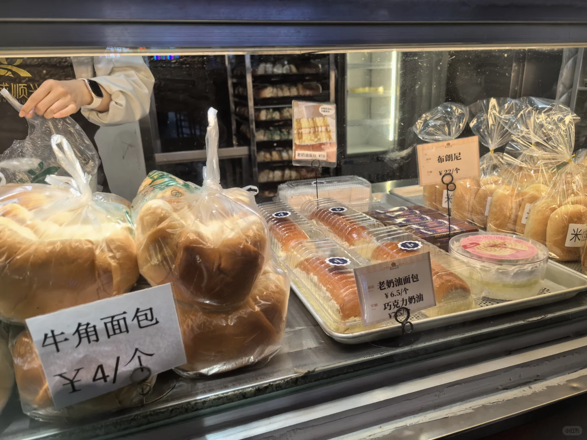

- 小红书：[顺兴食品 · 乱七八糟](https://www.xiaohongshu.com/explore/6a510736000000001003f5df)。Chrome亲开无参数链接显示暂时无法浏览/App扫码，实际搜索详情可读。
- 点评：[具体门店](https://www.dianping.com/shop/k5xKDCEpgWiMcuqe)。青岛具体搜索实际链接亲开头部推荐菜可读
- 高德：[搜索备选](https://www.amap.com/search?query=%E9%9D%92%E5%B2%9B%E9%A1%BA%E5%85%B4%E9%A3%9F%E5%93%81%E9%A1%BA%E5%85%B4%E8%B7%AF100%E5%8F%B7)。Chrome亲开精确检索实际结果可读，无place直链
- 图像原文件 SHA256：5717d53168760ee1cf188b78b56b5bc531ef6b82e51db38fe15292f1f4a1c66d，1440×1080。顺兴服装字样和玻璃柜牛角包、老奶油面包，保留原价牌及水印；价牌不作当前售价。

## 青岛 · 王姐烧烤

等级：optional。具体中山总店图文原图作者/回购评论主页，两平台同113号当前营业。真实近期口味争议很大，正反均认可鱿鱼相对可选，仅列顺路一串鱿鱼、无需排队的限制型备选。

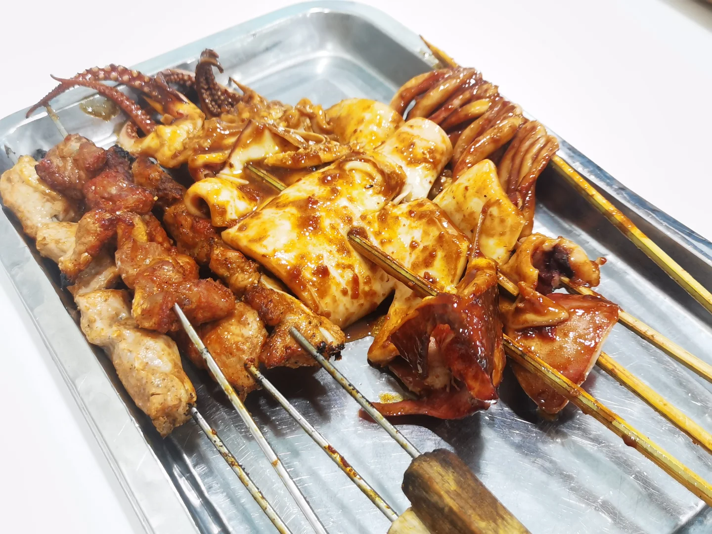

- 小红书：[青岛食记1⃣|王姐烧烤（中山路总店） · 牛牛探索记🐮](https://www.xiaohongshu.com/explore/68849aff0000000024008cff)。Chrome亲开无参数canonical App扫码读取限制，搜索详情正文与静态图可读。
- 点评：[具体门店](https://www.dianping.com/shop/l3Rdu0KogFGBZ7rG)。Chrome亲开同分店头部及默认3评论
- 高德：[地点](https://www.amap.com/place/B0FFFAF8MN)。Chrome亲开真实同总店完整详情可读
- 图像原文件 SHA256：7e004f3a646042cc03c91c5861061660f671f2c8e787fcfaa2f44d76de39d364，1440×1080。金属托盘上有刷酱鱿鱼串和肉串，与原帖菜品一致；分店依据保留在来源记录。

## 青岛 · 万和春排骨砂锅米饭

等级：optional。具体台东店实拍正文、评论及两位主页齐，两平台同地址当前正常营业；默认近期点评评价有正面体验但低分范围不足，顺路可选。

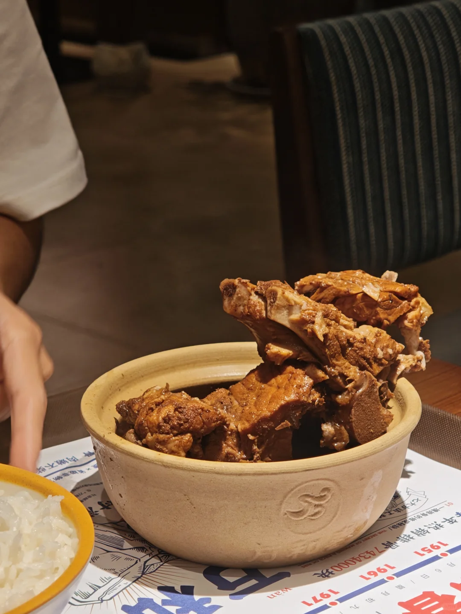

- 小红书：[惊！万和春竟然上糖水了😲（附菜单） · MapleSyrupWaffle](https://www.xiaohongshu.com/explore/6a957f05000000002a03b619)。Chrome亲开无签名链接显示暂时无法浏览/打开App扫码，搜索详情正文原图评论可读。
- 点评：[具体门店](https://www.dianping.com/shop/k4wItWds68ZsFbh7)。青岛搜索实际店链接亲开完整店页
- 高德：[地点](https://www.amap.com/place/B0FFFRR5R3)。Chrome亲开加载后完整店页可读
- 图像原文件 SHA256：7adf9bd499988d0786eaeea1672fb94c00d804540f46d19cb617650af6f3ea8b，1080×1440。陶砂锅大块排骨、米饭及桌面万和春品牌字样，与具体台东原帖菜品对应。

## 青岛 · 万众源排骨米饭

等级：optional。具体湛山总店正文原图与作者及具体口味评论主页，两平台同秀湛1现营业；负向搜索另游客09-03也认为排骨味道不错但未明确分店，不借其证明本店近期口碑。缺近期点评低分，只作午餐备选。

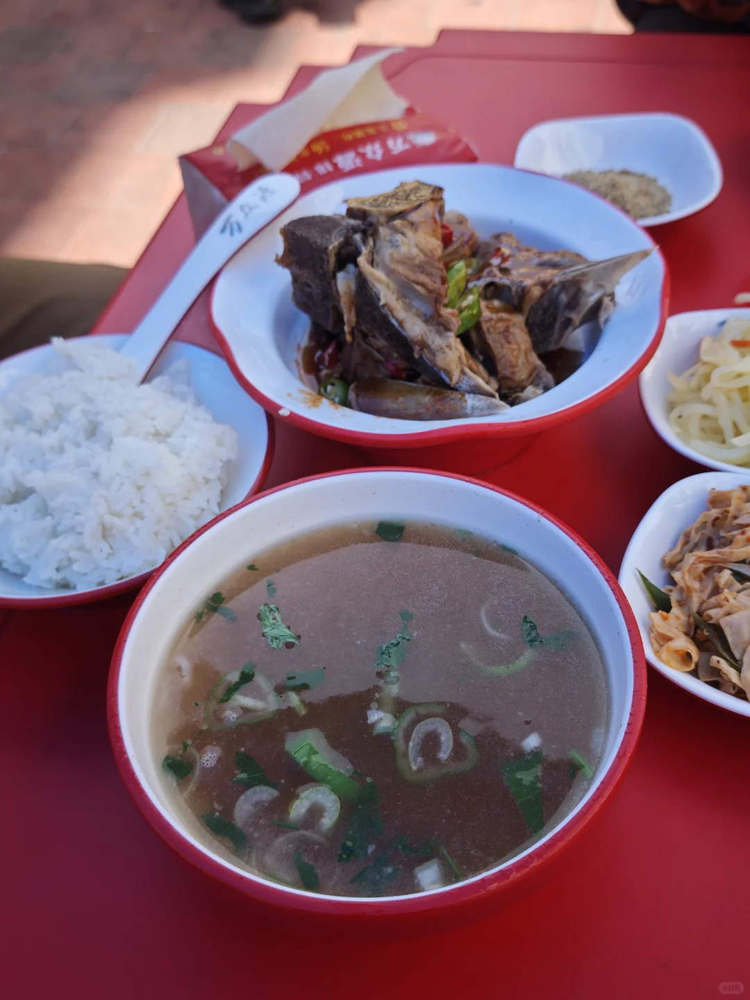

- 小红书：[公司离万众源总店也不远，今天试了试 · 雨汐和小皮的大朋友](https://www.xiaohongshu.com/explore/69fb07bb0000000036019ece)。Chrome亲开无参数canonical App扫码读取限制；搜索正文原图评论正常。
- 点评：[具体门店](https://www.dianping.com/shop/3634069)。Chrome亲开总店头部推荐菜与团购
- 高德：[地点](https://www.amap.com/place/B0FFFAH0IE)。真实搜索结果点开观察id后亲开无参数place，完整同店
- 图像原文件 SHA256：1a8be102fc5f671bb70f46c27a78e7b63b5199d6e1e4849e1cd8bedd4ea310d4，1080×1440。骨肉、米饭、汤和小菜及餐具标识可见，与万众源午餐原帖对应。

## 青岛 · 徐家老甜沫

等级：optional。普通旅行账号独立正文食品原图与同帖店牌，补充精确宁化39；点评正常次日开门、高德06–11，当前营业安排可核，近期口碑不足保留顺路可选。

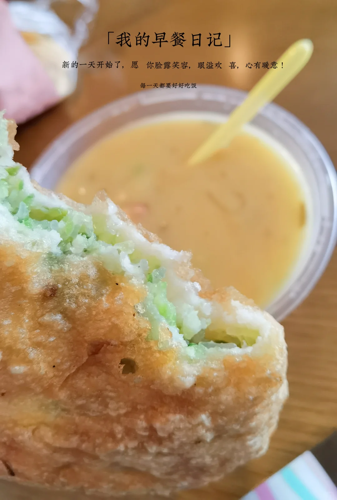

- 小红书：[青岛早餐之徐家老甜沫 · ✨栩多多](https://www.xiaohongshu.com/explore/66496725000000001303e4b8)。Chrome本次单独无参数canonical显示当前笔记暂时无法浏览/请打开App扫码查看，实际搜索取得带签名详情可读。
- 点评：[具体门店](https://www.dianping.com/shop/F15hclUyOFfnkMbs)。青岛具体宁化路搜索取得链接并亲开。
- 高德：[地点](https://www.amap.com/place/B0FFF9PFAZ)。Chrome亲开完整商户页。
- 图像原文件 SHA256：46bc6ffe6e0665d3e99b0c2e691c89c8a5a99e43698de6e55f8785614c1d0c4e，1080×1600。萝卜馅饼切面、黄色甜沫及原有早餐文字，正文和同帖店牌支持来源，非纯文字攻略。

## 青岛 · 于记老甜沫

等级：optional。明确于记广饶小学对面正文、同帖甜沫原图及普通个人倾向作者主页，点评同分店当天营业，另一篇具体口味帖一致。高德受限、近期差评未读，只列顺路备选。

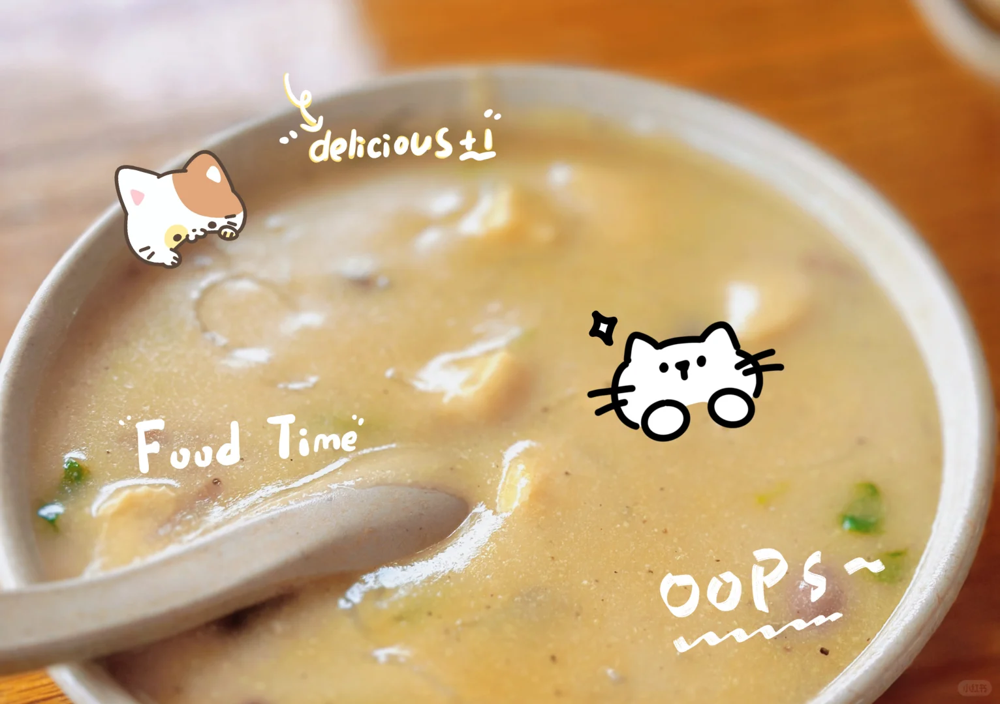

- 小红书：[老甜沫配火烧也太绝了！ · 陈七七🔆](https://www.xiaohongshu.com/explore/6a09299e00000000370349f5)。Chrome亲开无参数canonical显示当前笔记暂时无法浏览/请打开App扫码；搜索详情正文与静态原图正常读取。
- 点评：[具体门店](https://www.dianping.com/shop/19585035)。Chrome亲开同分店头部与推荐菜
- 高德：[搜索备选](https://www.amap.com/search?query=%E9%9D%92%E5%B2%9B%E4%BA%8E%E8%AE%B0%E8%80%81%E7%94%9C%E6%B2%AB%E5%B9%BF%E9%A5%B6%E8%B7%AF107%E5%8F%B7)。Chrome实际打开检索出现滑块验证，未处理
- 图像原文件 SHA256：870b84f5a950cb49055105e628be15cba691f3f518bd1f12154999a3c7e88f63，1532×1080。一碗黄褐色浓汤与汤勺，保留原猫贴纸和文字；与原帖甜沫描述一致，图片本身不证明分店。

## 威海 · 长兴烧烤·老辈文登烧烤

等级：caution。普通生活作者专帖实吃、真实门头图与唯一文登分店营业已核，主要偏咸口味争议；保留旧具体但未核实的处理卫生主张，近期口碑覆盖不足，仅谨慎候选不列必去。

- 小红书：[文登长兴烧烤🥓🥩 · 好运biubiu莲](https://www.xiaohongshu.com/explore/68e39134000000000301dd31)。实际无签名主帖直链暂无法浏览/需App扫码，签名搜索入口正文可读，不处理扫码或落盘签名。
- 点评：[具体门店](https://www.dianping.com/shop/k8NH7ABYVMipR8OU)。点评威海站内长兴烧烤唯一商户真实链接，实际亲开当前店基础与菜单。
- 高德：[地点](https://www.amap.com/place/B0277151X0)。真实搜索发现place，实际Web只读亲开同址基础与1条旧评论，无当前营业字段；当前营业来自点评。
- 图像原文件 SHA256：c315c5c35e086deb7e0fa161cd877b1a54bd2720f201793e3549b9b6642bd538，1080×1440。长兴烧烤发光门头、街边桌椅及食客；实际门店环境实拍，未冒称菜品近景。

## 威海 · 东源饭店

等级：exclude。存在未独立证实的餐后健康投诉且近期差评核验不足，审慎从推荐名单排除；并非认定投诉因果已证实。

- 小红书：[开了30多年的威海本地馆子 东源饭店 · 小众众乐乐](https://www.xiaohongshu.com/explore/6a0848d10000000036001fe3)。Chrome无参数canonical实际打开显示当前笔记暂时无法浏览，请打开App扫码查看
- 点评：[具体门店](https://www.dianping.com/shop/l17SPxQ7fafIJiff)。Chrome实际威海首页输入店名搜索，新标签结果唯一匹配；实际打开门店详情可读，更多评论引导App
- 高德：[地点](https://www.amap.com/place/B027700J57)。从原始地图榜单实际取得；Chrome本轮实际打开完整详情可读
- 图像原文件 SHA256：044497a0ff90e4d04d87caf72d1e8c760152d1dc108d5a7101f7888c6c2d3af2，888×1184。已实际查看原图：东源饭店金色门头与小区楼房、入门及菜单，店名清晰匹配专帖，地址门牌像16号而地图19-1，门牌读数待核不能替代地址

## 威海 · 福来天

等级：caution。两平台分店吻合且原图实看，但甜度分歧、未核实保存讨论及近期完整差评不足。

- 小红书：[福来天 韩乐坊店 · 羁绊](https://www.xiaohongshu.com/explore/6a69fc6e000000001101e473)。无参数Chrome实开显示当前笔记暂时无法浏览，请打开App扫码查看；带签名搜索笔记正文已读。
- 点评：[具体门店](https://www.dianping.com/shop/90440838)。Chrome实际打开真实图集，点击店名读取门店基础信息和3条精选评论。
- 高德：[地点](https://www.amap.com/place/B0FFHY4O66)。原榜单真实取得，本轮Chrome完整POI详情实读。
- 图像原文件 SHA256：8a71a6cd1fd159a0587bb2b327fc33438094e579930a4d1edd3d3fcb2410672e，1080×1440。view_image实际查看本地文件：柜台前手持透明袋装黄豆粉覆盖圆包，后方冷藏柜同款包装；标签BREAD N与豆粉包专帖吻合。没有沙冰，不把沙冰评价当照片可见证据。

## 威海 · 海诚饺子家常菜

等级：optional。普通旅游生活作者具体多次实吃、首帖近大相框地域支持和实际食品原图，与点评高德同分店地址吻合，点评显示当前营业；一般口味和吐刺条件写清，旧体验及近期全量差评不足，不列必去。

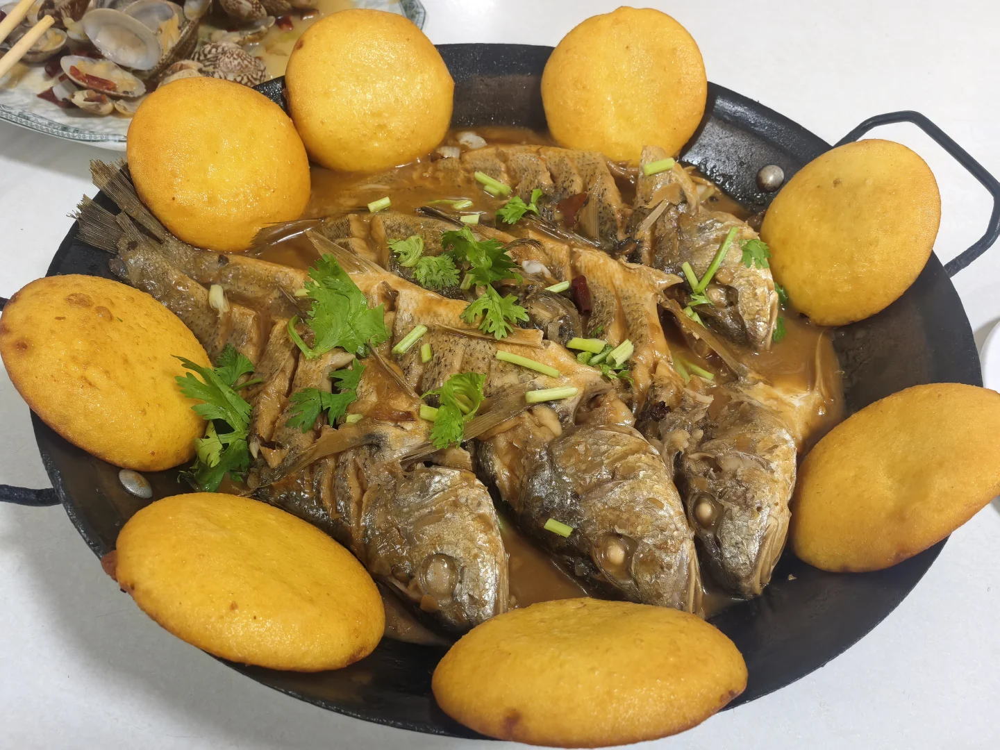

- 小红书：[海诚饺子馆｜威海的最后一顿饭 · 吃雪糕的彩虹糖](https://www.xiaohongshu.com/explore/685e29f1000000000d01b42c)。实际无签名主帖直链暂无法浏览需App扫码，签名搜索入口正文可读，不处理扫码或保存签名。
- 点评：[具体门店](https://www.dianping.com/shop/l3dXwJ6igNWvrjR6)。威海站内海诚饺子2结果，亲开会展店及蒿泊同名店核排除，基础菜单可读。
- 高德：[地点](https://www.amap.com/place/B027700YMU)。本輪实际Web只读亲开同址基础及1旧评，不使用其为当前营业依据。
- 图像原文件 SHA256：373c5130f3161b73da5e3a6abcbaa199220736ecb35fb5579016b7c4522c2f6e，1440×1080。浅黑锅小鱼汤与金黄色饼子、香菜、花蛤，匹配鱼锅饼子正文；分店依正文与平台。

## 威海 · 韩仁阁米肠汤饭

等级：optional。独立专帖图文实读，两平台可读并有6天前精选好评，但本地消费背书与完整近期差评不足，且分店/时间地址有边界。

- 小红书：[韩仁阁米肠汤饭 · zzza再吃一口💕](https://www.xiaohongshu.com/explore/6a6410b3000000000100dbef)。Chrome实际无参数直链显示当前笔记暂时无法浏览，请打开App扫码查看；带搜索签名正文已读。
- 点评：[具体门店](https://www.dianping.com/shop/127940820)。真实图集入口实际打开，点韩乐坊店店名读取完整门店基础及3条精选。
- 高德：[地点](https://www.amap.com/place/B0FFKNXYUM)。本轮高德原生搜索威海韩仁阁，唯一结果点击实读取得真实POI B0FFKNXYUM，再实开place直链确认。
- 图像原文件 SHA256：dbcc64e3d484569bbfa91a964418f6176f6b7c5bbdca4f8be5e6259f640f4ca7，1440×1080。view_image实看下载文件：黑色汤碗中葱韭菜与内脏切片，筷子夹米饭肉片，右侧红色辣炒肉片洋葱及盘中泡菜/小菜。照片无门头或店名，店关联依赖原帖标题，不能凭图片确认分店。

## 威海 · 老前玉米面

等级：caution。专帖明确分店地址、真实门头营业牌与本轮高德周营业时间相符，普通生活作者及多条口味正反评论已读；套袋碗和服务口味争议需接受，点评核查仍缺。

- 小红书：[打卡 老前玉米面 · one](https://www.xiaohongshu.com/explore/69a91a4700000000150224b1)。实际无参数直链仅错误页导航，正文不可见；带搜索入口正文已读。
- 点评：[搜索备选](https://www.dianping.com/search/keyword/152/0_%E8%80%81%E5%89%8D%E7%8E%89%E7%B1%B3%E9%9D%A2)。本轮从点评威海首页搜索输入店名并打开真实搜索结果：0个相关商户。
- 高德：[地点](https://www.amap.com/place/B0FFFTIAWR)。真实place链接Web已打开有店名地址旧评价；Chrome直开初始只地图框，随后站内搜索唯一结果点击完整详情实读。
- 图像原文件 SHA256：f0d509d9aa08d64b98754323e241b3c1a6f7aee5d2377d05e26b6e110ce5f9f3，1440×1080。root实看黄色门头红字老前玉米面与环翠区老前小吃店，玻璃门黄牌写9:00–19:30/周五周六17:30，与主帖具名门店及地图时间相符；原图作者打卡文字完整保留。这是门面照片，不是面碗。

## 威海 · 米笑情

等级：caution。独立专帖、原图、门店链接及营业展示已核，但排队服务存在分歧，近期差评覆盖不足。

- 小红书：[韩乐坊/米笑情好吃😋 · 半糖](https://www.xiaohongshu.com/explore/6806041d000000001d01c4c6)。实际跳转404，300031 当前笔记暂时无法浏览，请打开App扫码查看
- 点评：[具体门店](https://www.dianping.com/shop/H3PfMKgoRhZDemrn)。Chrome实际打开照片页后点击店名进入门店主页面，可读；更多点评引导App
- 高德：[地点](https://www.amap.com/place/B0FFG7XZG8)。Chrome原生高德搜索威海米笑情，点韩乐坊店，再实际打开所见POI直链，门店详情可读
- 图像原文件 SHA256：83308e3ed10461675569c8ce8bbd7cbd2d11dc9a3a301f7fa36776538a003f2c，1440×1080。1440x1080拌冷面配半蛋、黄瓜、胡萝卜，左上猪排边缘；吻合该帖猪排饭与拌冷面正文

## 威海 · 茉娜的甜品

等级：exclude。虽点评和高德均显示同址当前营业，但昨日实际读到异物与异味消费者主张，未核实且未见解决；按采集合同暂排除，不作已确认食品安全事故。

- 小红书：[📍WeiHai威海这家甜品店也太chic了！ · 乌梅子酱](https://www.xiaohongshu.com/explore/69d8f87e000000001a033267)。本轮实际无签名explore直链显示当前笔记暂时无法浏览/请打开App扫码查看；签名搜索入口专帖正文可读，未处理扫码或绕过，签名不落盘。
- 点评：[具体门店](https://www.dianping.com/shop/93503115)。实际Chrome亲开完整店页，基础营业、地址及3条精选实读。
- 高德：[地点](https://www.amap.com/place/B0FFI91SVE)。站内威海茉娜甜品唯一结果，点击完整详情取得真实POI，实读当前基础与7条历史评论；实际无参数place直链仅地图框，无店详情。
- 图像原文件 SHA256：13b6f0f1620422426dbc0f2d6667dc7c315ff2b23aed20d35c781e129b80b3be，1080×1263。root实看黄色门面、MONA PATISSERIE CAKE COFFEE GELATO两块招牌及原作者威海茉娜甜品叠字，保留原图标识；与韩乐坊具名专帖店面相符，不证明当前食品质量。暂排除记录不计推荐。

## 威海 · 七丼DONG烧肉丼饭

等级：caution。有同店旧卫生与肉质反面经历，当前完整低分范围不足，虽有4天前精选好评也不列必去。

- 小红书：[韩乐坊七丼烧肉饭 · 宇宙无敌超可爱吃饭神](https://www.xiaohongshu.com/explore/67e76b45000000001c00e76e)。本轮Chrome无参数canonical实开显示当前笔记暂时无法浏览，请App扫码；搜索签名正文已读。
- 点评：[具体门店](https://www.dianping.com/shop/H6zkM9gwQhcAXELa)。威海首页原生搜索七丼得到唯一真实门店，实开详情可读。
- 高德：[地点](https://www.amap.com/place/B0FFKK9G4I)。原真实链接本轮Chrome完整详情实读。
- 图像原文件 SHA256：a5d38883b251230ffe6165150d06fb23f55651abccaac860b917f1110f8b0cb5，1440×1080。实际原图为七丼品牌碗内双拼肉饭，配泡菜沙拉汤，店名在碗沿清晰可见。

## 威海 · 泉都饼店

等级：caution。普通生活作者实吃、长期消费评论者同城日常支持和独立专帖，当前点评同名市政大厦分店营业已核；旧转让及换老板后口味下降评论需要接受，门牌差异写清，不列必去。

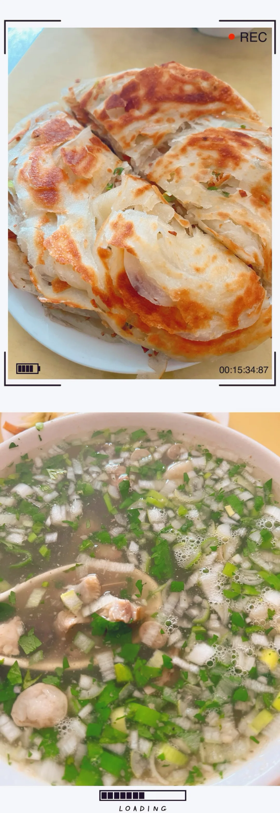

- 小红书：[泉都饼店：一家经常去的羊汤店 · 大王呀](https://www.xiaohongshu.com/explore/6715078100000000160207c1)。亲开无签名主帖实际暂无法浏览/App扫码；正常搜索入口全文可读，未处理验证或保存签名。
- 点评：[具体门店](https://www.dianping.com/shop/laCzSRxVXJRjZOxt)。本轮原生站内泉都唯一结果，真实链接亲开主店可读基础/菜单。
- 高德：[地点](https://www.amap.com/place/B0277016P2)。本轮Web亲开实际地址/电话及一条旧评，无当前营业字段，不当当前营业依据。
- 图像原文件 SHA256：e7385cf26d0af6ceb5085dd9033e8c241dc6e48fb0c9028e6b3040f188a899d8，1080×3137。保留REC等原拼图文字，上部葱油饼、下部汤碗与正文对应；未从图确认门牌。

## 威海 · 群发饺子

等级：caution。具名专帖具体实吃、完整作者主页和原门头图，山大地域匹配且同分店点评当前营业支持；旧体验、主帖0评论与近期口碑覆盖不足保留慎选，不作为高可信必去。

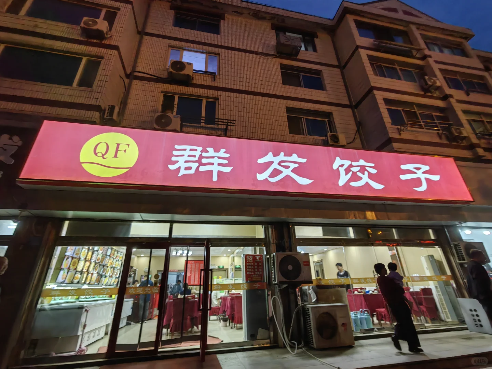

- 小红书：[老威海人都知道的饭店 · 梁大雪。](https://www.xiaohongshu.com/explore/68eb9cda0000000004000be9)。本轮亲开无签名主帖暂无法浏览/App扫码；正常搜索入口全文可读，不处理验证。
- 点评：[具体门店](https://www.dianping.com/shop/G8OkPamYOeRrPCxA)。本轮站内实际2分店结果，亲开山大门店基础菜单与营业，不重复未读评论。
- 高德：[地点](https://www.amap.com/place/B0277016QY)。复用本代理已有实际Web亲开可读证据，未重复成功静态核验；本轮未原生重读，不把旧评当当前营业。
- 图像原文件 SHA256：5831f243b305fcd3981b6abe48f4c9e459780d97fed33ddd29c555e466cba289，1440×1080。夜间粉色QF群发饺子招牌与店内场景明确；作为门店原图使用。

## 威海 · 若见甜汤铺

等级：exclude。具名普通食客专帖与原图已齐、作者评论者主页和反搜完成，但两平台没有取得当前营业依据，暂不进入推荐库；无营业结论不能据搜索无结果认定关闭。

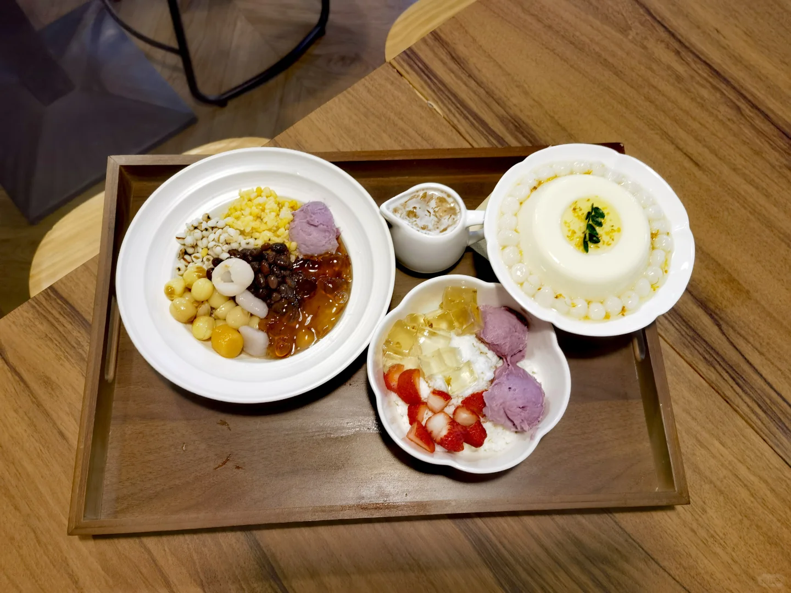

- 小红书：[海水浴场的新甜水店，口味三星半性价比五星 · 想吃好多包砸](https://www.xiaohongshu.com/explore/684149c200000000230179d4)。本轮亲开无签名主帖当前暂无法浏览/App扫码，正常检索入口正文可读，不处理验证。
- 点评：[搜索备选](https://www.dianping.com/search/keyword/152/0_%E8%8B%A5%E8%A7%81)。本轮正常站内若见甜汤0匹配，按页面建议简化若见仍0，真实搜索页可读。
- 高德：[地点](https://www.amap.com/place/B0LAHHHVZE)。既有实际Web详情仅地址电话可读；本轮亲开直链框架无详情，正常威海若见甜汤铺搜索仅喜柿/阿福等异店。
- 图像原文件 SHA256：da15989f3677ac2484b917dc42f4f19beea02c81e694aeb15df83fca492e50eb，1440×1080。木托盘上三碗不同甜品与小奶壶，与原帖甜品描述相符；不据照片确认当前营业。

## 威海 · 三点小吃

等级：optional。普通生活作者明确四菜实吃、原图与明确吉林13副帖匹配，点评同分店当前营业及4天前消费精选，高德同店当前时间一致；旧争议主要口味和等候，写清条件后作为顺路可选，不因未读全量差评自动排除。

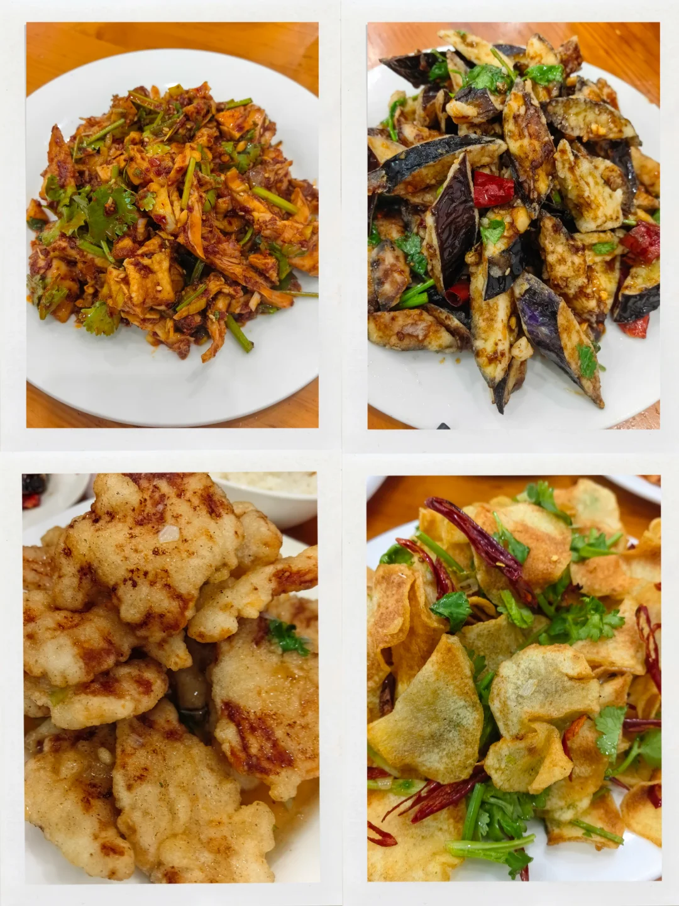

- 小红书：[打卡三点小吃非常成功🎉🎉 · 大王呀](https://www.xiaohongshu.com/explore/69dfa0bf000000002103a9bc)。真实无签名主帖直链暂无法浏览/App扫码；正常主页入口可读，未处理验证。
- 点评：[具体门店](https://www.dianping.com/shop/k6wuoq6y4s0eZZky)。既有真实相册发现ID本轮亲开主店完整基础及3精选。
- 高德：[地点](https://www.amap.com/place/B0JDMZS1IZ)。实际原生搜索唯一山大店点完整详情可读；从可见URL提取POI再亲开canonical，仅地图外框，不声称该直链正文可读。
- 图像原文件 SHA256：09320b78a6b39e7acb71dd2a04e3599d5b19e88da63738d3c947309a5f9f3bab，1080×1440。四格原拼图为香菜肉菜、茄子、炸肉片和薄土豆片，与原帖四菜描述对应。

## 威海 · 山后海菜包子

等级：exclude。已核具体分店当前营业，但旧具体异物主张未独立证实或解决，普通正面独立背书偏弱，暂排除。旧指控不等于当前已确认隐患。

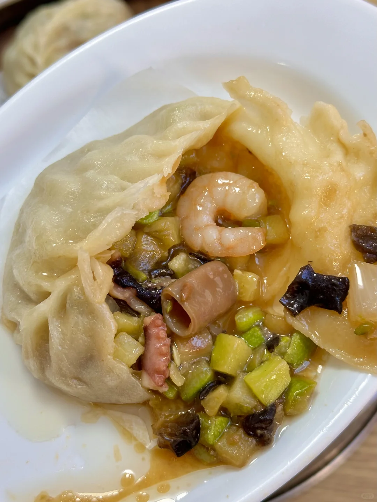

- 小红书：[荣成这家包子铺！！上新了！！！ · momo酱](https://www.xiaohongshu.com/explore/69510cbb000000001f00b4c1)。实际無签名直链显示笔记暂无法浏览需App扫码；签名搜索入口正文完整可读，未处理扫码，签名不落盘。
- 点评：[具体门店](https://www.dianping.com/shop/H7uJnETSt5Zz4E2C)。站内真实14商户结果取得荣成店链接，亲开当前基础、菜单与团购。
- 高德：[地点](https://www.amap.com/place/B0K6KSZNQH)。已实际Web只读亲开原始place页，地址电话及1旧评论可见；Chrome同一无参数入口仅地图框。没有把Web地址当当前营业依据，当前营业来自点评。
- 图像原文件 SHA256：c7aac0fc01f7e3d9a28b955dd06304273cdda52d4672b0fa6ca09d8a1fef28dc，1080×1440。剖开薄皮海鲜包，虾仁与绿色菜丁等馅料；品类匹配，未凭图片确认门牌或全部食材。

## 威海 · 台北小城

等级：caution。明确财富广场营业及专帖支持，但口味争议、品牌分店反面评价和当前全量低分不足，不列必去。

- 小红书：[威海/台北小城（财富广场店）😋 · 半糖](https://www.xiaohongshu.com/explore/69f41f540000000023015113)。无参数单独实开显示当前笔记暂时无法浏览，请打开App扫码；签名搜索正文实际已读。
- 点评：[具体门店](https://www.dianping.com/shop/2112808)。真实web搜索财富广场店取得，Chrome店页完整实读。
- 高德：[地点](https://www.amap.com/place/B027701AHK)。原生搜索得到财富广场店并点击实际详情，店名分店与主帖明确相符。 独立web亲开所见POI无参数直链可读，返回同店地址电话。
- 图像原文件 SHA256：3949c21ab712be94de4830cf98e101400fe443fbc6fade05ecc91e0cc4117b07，1080×1440。本地view_image实看：前景红汤海鲜炒码面带虾贝蔬菜，中部小碗拌开的炸酱面、后方未拌炸酱面，旁边糖醋肉和泡菜。与财富广场明确专帖正文吻合；未将旧未定分店原图作主图。

## 威海 · 天下无蹄·韩式猪蹄料理店

等级：exclude。当前营业已核，但历史严重卫生主张未独立核实，当前近期完整差评不足，按合同暂排除；不认定旧指控属实或仍持续。

- 小红书：[🍋威海吃喝：天下无蹄 · 🍋レモン](https://www.xiaohongshu.com/explore/6824424e0000000021007ea6)。无参数单独实开当前笔记暂时无法浏览/App扫码，签名专帖已读。
- 点评：[具体门店](https://www.dianping.com/shop/79336772)。真实web搜索相册发现，Chrome对应主店完整实读。
- 高德：[地点](https://www.amap.com/place/B0FFHUMNDY)。原生威海天下无蹄唯一结果点击完整详情可读，实际POI ID B0FFHUMNDY；独立web亲开稳定直链提示不可访问，分开记录，不保存原生URL里的地图视域参数。
- 图像原文件 SHA256：ee63d571b3ced9e7b7d7c56d4aadbf23061b5d1fc813dfd50028bf041b41bd1d，1080×1440。root逐张查看实际原文件：黑椭圆盘内猪蹄及浅色菜包肉双拼，上撒芝麻；后有生菜、泡菜韭菜蒜片及蘸料，与专帖店名正文及该餐匹配。

## 威海 · 田埜冰屋

等级：caution。专帖分店和原图、两平台当前营业及地址已核；舒芙蕾有正面评价，但近期刨冰低评具体，原帖缺消费细节，不列高可信必去。

- 小红书：[田埜冰屋 韩乐坊店 · 爱](https://www.xiaohongshu.com/explore/6a8fb34e000000001f005158)。本轮实际无签名直链错误导航页正文不可见，搜索带签名入口已读。
- 点评：[具体门店](https://www.dianping.com/shop/110352189)。真实图库发现shopID，本轮Chrome实开店页全文基础及3条精选可读。
- 高德：[地点](https://www.amap.com/place/B0FFJCS6AP)。本轮高德站内搜威海田埜冰屋，有高区与韩乐坊两结果，点击乐天世纪城5-4-12A完整读取取得POI，再实际place直链仅地图框；两范围分开。 补充Web只读实开同一已知place直链：工具不可访问，未额外循环入口。
- 图像原文件 SHA256：46715456f4061000de5625dc371031a58feb6d0d1c6061e81d156aaca7ae9e8c，1440×1080。root实看花纹白盘上三块舒芙蕾、奶油及白色团子，撒浅色粉，田埜冰屋品牌插旗清楚，木桌背景；匹配正文豆乳舒芙蕾。具体韩乐坊分店依据帖子标题与平台地址，图片本身不证明街号。

## 威海 · 羽咖啡

等级：optional。普通食客专帖具体推荐开心果巴斯克，原图实看食品；两平台当前新址与营业时间一致，点评5天前确认扩建消费。咖啡争议与近期完整低分覆盖不足保留，非必去。

- 小红书：[羽咖啡｜威海巴斯克界的神🍴哈哈哈 · 小宋菜奈](https://www.xiaohongshu.com/explore/6a5f15f9000000002201b8ea)。本轮实际无签名直链错误导航页正文不可见，签名搜索入口正文可读，签名不落盘。
- 点评：[具体门店](https://www.dianping.com/shop/l1vpU3wxpcX3HjeL)。本轮点评威海站内搜羽咖啡唯一商户取得真实链接，实开店页基础及3条精选。
- 高德：[地点](https://www.amap.com/place/B0HANRMVFT)。站内搜威海羽咖啡取得唯一结果，点击完整详情读新址营业取得POI，再实际place无参数直链仅地图框；范围分开。 补充Web只读实开同一已知place直链：工具不可访问，未额外循环入口。
- 图像原文件 SHA256：853a4ccb6f708cc3f358ad63f6426147af8a2d9d75ccc4857779e07b9cc9e2ac，1080×1440。root实看木桌上的绿色巴斯克蛋糕切块、冰淇淋和咖啡，纸盒羽品牌标志可见，原小红书标识保留；与专帖开心果巴斯克及冰淇淋描述相符。图片无门牌，新址依据两平台迁址核验，不把旧店当另一家。

## 威海 · 真味米肠汤饭

等级：caution。普通食客具名专帖、原图与完整主页，另独立具体比较体验，点评唯一真味门店与高德同址且当前营业。旧异物主张虽作者称退款但未核实，保留慎选与证据范围，不将旧个案断言为当前事故。

- 小红书：[又吃上米肠汤饭了 · momo](https://www.xiaohongshu.com/explore/686b7082000000001301308e)。本轮亲开无签名主帖当前暂无法浏览/App扫码；正常搜索入口全文可读，不处理验证。
- 点评：[具体门店](https://www.dianping.com/shop/i3gTi8IjglLoCZ4C)。本轮站内搜索实际唯一真味结果，亲开基础门店页可读。
- 高德：[地点](https://www.amap.com/place/B0FFFE4UHI)。本轮原生无签名地点直开仅地图框架，无店详情；复用本代理先前从烟火小店榜单点击实际Web详情可读地址，不重复成功静态核验。
- 图像原文件 SHA256：39b025ab6e86ff5a1ef14d1ec55fdc59f23132864079b2426ae6dcad7a6dd041，1440×1080。黑石锅汤、米饭和小菜，背景双玩偶，与真味米肠具名原帖的这餐对应。

## 连云港 · 陈家味·特色小菜馆

等级：optional。唯一品牌和菜单对应当前具体DP店营业；口味甜辣与预订服务限制明确，不列必去

- 小红书：[连云港吃喝记录第3️⃣0️⃣弹 陈家味小菜馆 · 哈利波菜](https://www.xiaohongshu.com/explore/6a9ba39c00000000260309c7)。Chrome亲开web_error_page导航壳，没有笔记正文
- 点评：[具体门店](https://www.dianping.com/shop/laTE5RDlnTEIMQ7p)。上轮搜索导航timeout，本轮直接读加载后搜索唯一陈家味并亲开店
- 高德：[搜索备选](https://www.amap.com/search?query=连云港陈家味特色小菜馆)。补核Enter后实际遇滑块验证，未处理
- 图像原文件 SHA256：dc74cb7615731351b02ec6734d00fa88ffd88ebde7e2e4f2023e8bd50964ccff，1440×1080。鸡爪、茄子、炒海兔的原拼图和陈家味特色小菜馆文字，对应具名正文；原水印保持。

## 连云港 · 大灌云海鲜家常菜馆

等级：optional。XHS订单图明确分店，原始实拍与菜单匹配，两平台当前营业同址支持；仅单游客主帖、评论无独立本地食客、点评未查全近期差评，不能评必去。

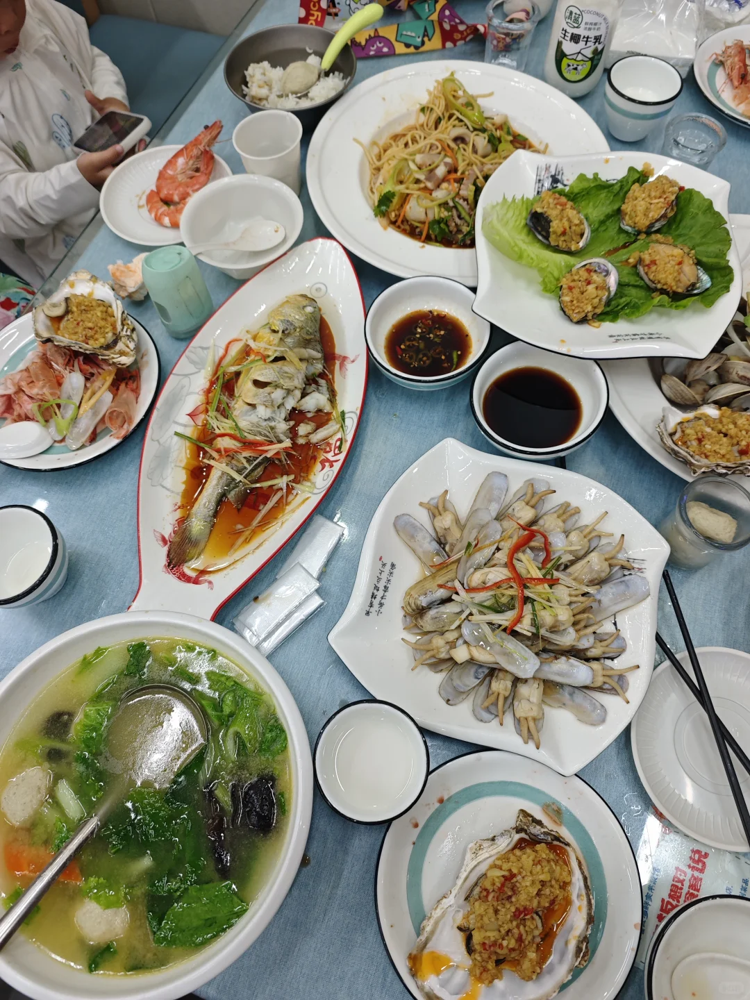

- 小红书：[连云港-嘉瑞宝附近海鲜店 · 灶上有饭吃](https://www.xiaohongshu.com/explore/6a06b82200000000070110ac)。亲开当前笔记暂时无法浏览，请打开小红书App扫码查看；搜索入口可读
- 点评：[具体门店](https://www.dianping.com/shop/H896BqKJN21N0OqA)。实际搜索唯一嘉瑞宝结果取得真实链接再亲开正文正常
- 高德：[地点](https://www.amap.com/place/B0FFHQZNFK)。实际亲开公开place链接正常门店内容
- 图像原文件 SHA256：dc017a1497660b1886c045a1652fe62c9231b3582e071c03250b7b0d72102acd，1080×1440。桌上清蒸鱼、贝类、虾、面和汤，与套餐正文相符；店名依订单证据。

## 连云港 · 单姐凉粉

等级：optional。最新单店招牌照片与菜单明确，点评唯一凉粉摊当前营业；蒜味/分店门牌尾号和距离限制保留，非必去

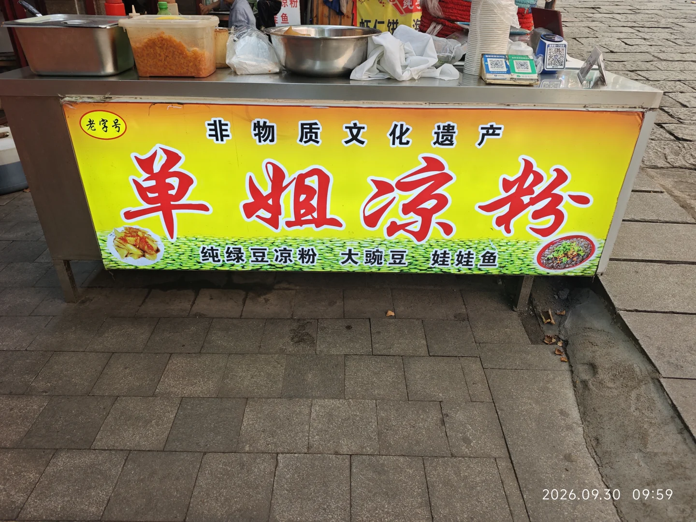

- 小红书：[连云港凉粉 · 小红薯FE7CCD9A](https://www.xiaohongshu.com/explore/6abc931e000000001c00f736)。Chrome亲开当前筆记暂时无法浏览需App扫码；签名搜索可读
- 点评：[具体门店](https://www.dianping.com/shop/k832cPyuwvaFtiHa)。Chrome实际搜索唯一单姐凉粉摊与老街景区，亲开真实店link
- 高德：[搜索备选](https://www.amap.com/search?query=连云港老街单姐凉粉)。Chrome亲开合法搜索唯一民俗商业街店
- 图像原文件 SHA256：9297dfaba41bff6b424d7a51b1fe6fd40fb331cb3869de5a4f836de87d19d2dc，1440×1080。单姐凉粉黄色摊牌，纯绿豆凉粉、大豌豆、娃娃鱼菜单及调料台；真实摊位而非攻略封面。

## 连云港 · 大嫂特色面馆

等级：optional。唯一品牌与菜单匹配，DP高德具体地址营业一致，原图实看；缺多帖当地评论与全量近期低分，不列必去

- 小红书：[连云港吃喝记录第1️⃣3️⃣弹 大嫂特色面馆 · 哈利波菜](https://www.xiaohongshu.com/explore/693c0c98000000001e02943a)。Chrome亲开web_error_page导航壳，没有笔记正文
- 点评：[具体门店](https://www.dianping.com/shop/H6S783vBKphrJS1x)。Chrome实际搜索唯一大嫂并亲开
- 高德：[地点](https://www.amap.com/place/B0FFGPDH1Y)。Web搜索取得实际place链接，Chrome亲开再次读详情成功，无验证操作
- 图像原文件 SHA256：71731f828ef121e2e8ca449eb1c11f61358360d66c147cea4ba189c1a8ee54ac，1486×1080。两种面食的原拼图带大嫂特色面馆文字，浓卤面与宽面对应正文描述。

## 连云港 · 古厝甜汤

等级：optional。XHS近期真实菜图与店名明确，DP具体店营业可核，0互动且地图未找到不列必去

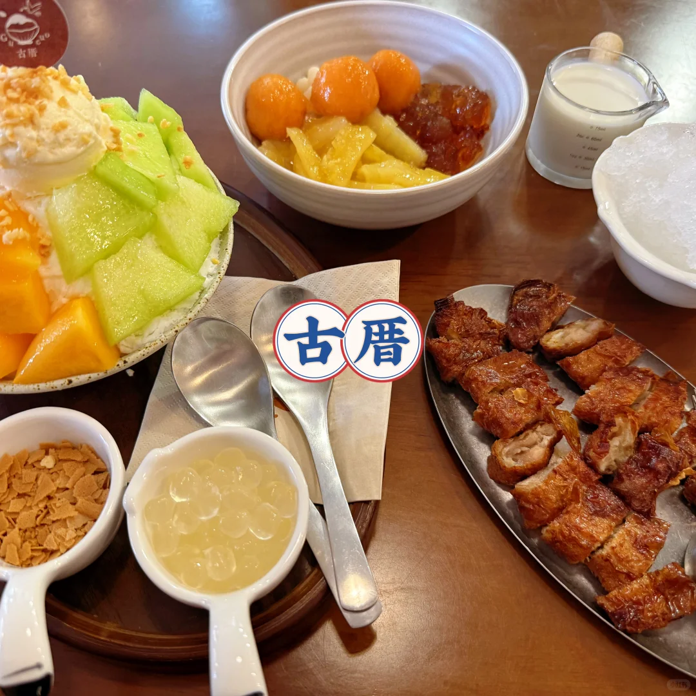

- 小红书：[连云港吃喝记录第3️⃣1️⃣弹 古厝甜汤 · 哈利波菜](https://www.xiaohongshu.com/explore/6ab79c05000000000100aecf)。Chrome亲开当前笔记暂时无法浏览需App扫码；主页签名帖子可读
- 点评：[具体门店](https://www.dianping.com/shop/k1ohL1E5LDgCFRU0)。Chrome实际搜索唯一古厝店link并亲开
- 高德：[搜索备选](https://www.amap.com/search?query=连云港古厝甜汤)。Chrome实际搜索页面可读但返回杭州异店，未核本店
- 图像原文件 SHA256：3e53760de520ba620e6a9c30db6e7dc05559024e8cd2ef1b2383d24e0f62e176，1080×1080。甜汤、水果冰及炸卷实拍，有古厝原文店名，菜品与专帖记录匹配。

## 连云港 · 红霞米线

等级：caution。同分店当前营业可核、图文真实，近期肉量甜味与未核容器负面提醒较集中，保留为谨慎备选

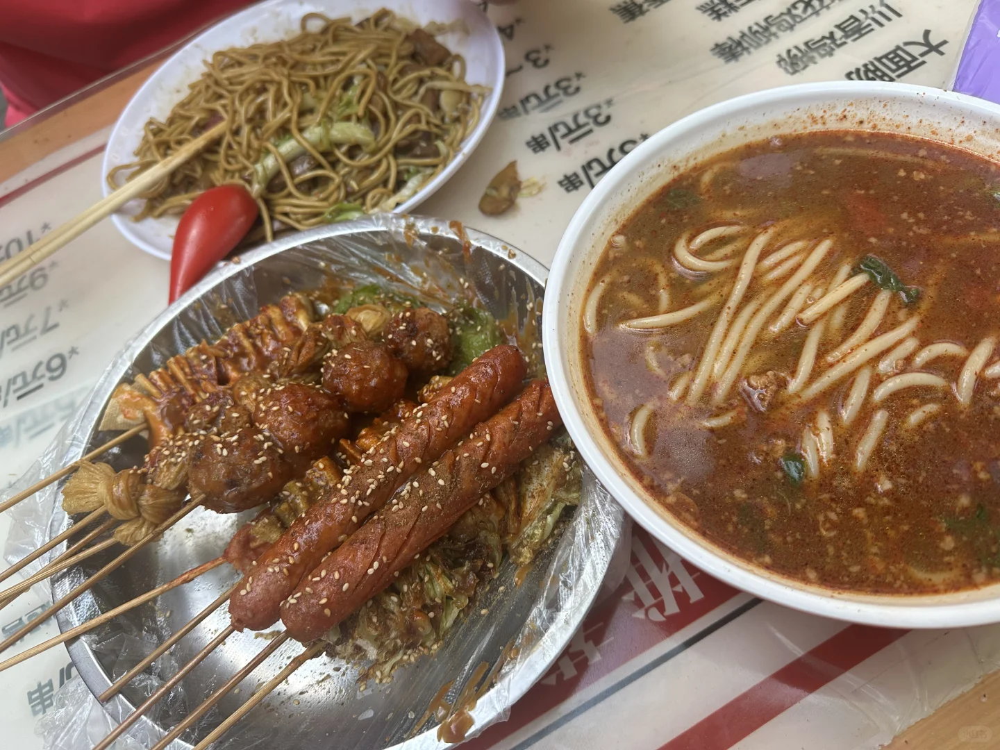

- 小红书：[红霞米线拔草 · 今天开心了嘛](https://www.xiaohongshu.com/explore/6a9e59ab000000002502d5df)。Chrome亲开web_error_page导航壳，没有笔记正文
- 点评：[具体门店](https://www.dianping.com/shop/l7BFOJeUJO6Pt58O)。实际搜索取得同古城店并亲开，补读展示评价
- 高德：[地点](https://www.amap.com/place/B0206021MI)。Web实际取得place并Chrome亲开正常详情，无验证操作
- 图像原文件 SHA256：a40a44014f839d828d9c6adbd0a8eec1ce2aefa4875848804fec5fa4327a1862，1440×1080。右侧大碗汤米线；左侧炸串与后方炒面不归本店。

## 连云港 · 汉中黄老头凉皮凉面

等级：caution。个人复购及地址相互支持，点评营业可见，但卫生体验争议且近三月差评未覆盖，谨慎选择

- 小红书：[个人觉得连云港最好吃的凉面！！！ · 懿.](https://www.xiaohongshu.com/explore/6a8d9bb10000000021033906)。Chrome亲开当前笔记暂时无法浏览要求扫码App，签名搜索可读
- 点评：[具体门店](https://www.dianping.com/shop/k2XE5ID5VStxw1H3)。Chrome店名搜索真实取得链接并亲开
- 高德：[搜索备选](https://www.amap.com/search?query=连云港汉中黄老头凉皮凉面)。Chrome亲开后店名查询实际结果可见
- 图像原文件 SHA256：3afecc8e7db8b8f1b575609ec335e33773357534e7fdcebac47588d57cdf52ae，1080×1920。本地view_image实际核查：凉面制作摊玻璃柜、面筋凉面黄瓜配料；与主帖店内场景匹配，未把人物作为菜品

## 连云港 · 间味·家庭料理

等级：optional。唯一品牌与菜单对应当前具体DP营业，原图匹配，口味/价位/空间和历史飞虫反馈明确，非必去

- 小红书：[连云港吃喝记录第2️⃣8️⃣弹 间味 · 哈利波菜](https://www.xiaohongshu.com/explore/6a6ea36f0000000033035300)。Chrome亲开web_error_page导航壳，没有笔记正文
- 点评：[具体门店](https://www.dianping.com/shop/H1bwVLIJ2eDIEWXL)。Chrome实际搜索唯一间味店并亲开
- 高德：[搜索备选](https://www.amap.com/search?query=连云港间味家庭料理)。Chrome亲开Enter后再次读结果匹配间味
- 图像原文件 SHA256：82cb6cc0d66ac49a7b08156929361336787d1c3236c3f9cfff279180160dd56b，1080×1440。原拼图有间味字样及多盘饭菜、烤鱼；保留原水印。

## 连云港 · 秦记肉夹馍

等级：optional。两平台当前同址营业、主帖真实食物及两店区别补帖支持；游客与粉丝视角较多，未读完整近期差评，不能评必去。

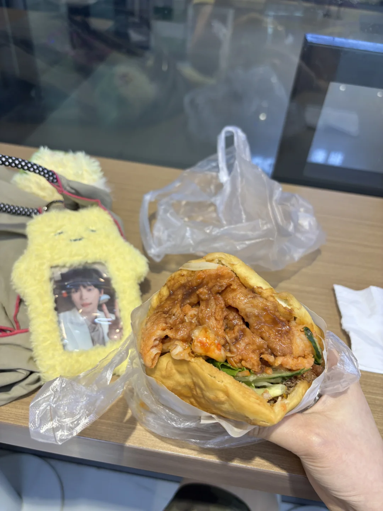

- 小红书：[连云港此行最好吃的就是这个肉夹馍！ · 三工Eazy](https://www.xiaohongshu.com/explore/6a351c5b000000000800221a)。亲开显示当前笔记暂时无法浏览，请打开小红书App扫码查看；搜索入口正文可读。
- 点评：[具体门店](https://www.dianping.com/shop/G2AnTjWwsw1rb9jp)。亲开具体门店正文、当前营业和近期评价可读
- 高德：[地点](https://www.amap.com/place/B0FFHIRNPC)。正常搜索点开结果取得真实POI id，再亲开公开place链接正常可读
- 图像原文件 SHA256：aafae29b77d411378c28788485cd18a5082bbc645192a6c7770ef60116987fb7，1080×1440。手持炸饼夹肉与蔬菜，背景有黄色挂件；无店牌，店名依正文匹配。

## 连云港 · 秋田面包房

等级：optional。XHS青年路店牌与地址明确，点评亲开当前营业，地图青年路9号对应；主帖旧且反向检索噪声大，作为可选而非必去

- 小红书：[旅行中遇到的面包店：连云港（2） · 兔子家的快门与慢炖](https://www.xiaohongshu.com/explore/648d7dbf0000000027028ed8)。Chrome实际单独打开当前笔记暂时无法浏览，需扫码App；签名搜索可读
- 点评：[具体门店](https://www.dianping.com/shop/EEeWsPj7YZjCDUAc)。Chrome实际搜索秋田面包房青年路取得真实链接并亲开
- 高德：[地点](https://www.amap.com/place/B0FFHZ6L1Q)。web工具实际亲开可读店名地址
- 图像原文件 SHA256：8f8a93f30c4ffc85b7490a3de666036e60b12795115a5ceac48338c16b76f447，1280×853。root实看秋田店内面包货架、9 QIUTIAN BAKERY标识与秋田汉字，画面中下部©Zhang Peng Photography及右上YUMMY LAB均完整保留；符合专帖青年路9号实访描述，属于店内食品实景照片。

## 连云港 · 后街苏记娃娃鱼

等级：caution。整洁路平台营业已核，但主帖照片分店未知、两平台门牌尾号差异；谨慎候选

- 小红书：[“连云港”出差偶遇-苏记后街娃娃鱼电烤串 · Kya卡卡](https://www.xiaohongshu.com/explore/6a85490a0000000022030faf)。Chrome无参数亲开当前笔记暂时无法浏览需App扫码；签名搜索入口可读
- 点评：[具体门店](https://www.dianping.com/shop/G7YpN7WyhmnrGxzG)。Chrome搜索取得两店真实link并亲开整洁路
- 高德：[搜索备选](https://www.amap.com/search?query=连云港苏记后街娃娃鱼整洁路)。Chrome亲开合法搜索返回整洁路店
- 图像原文件 SHA256：b257c2905964fbbc3b9fdf11baa1786a17713cdbd02fc71e3d7f7be74dd88656，1080×1440。root实看前方青花碗内深色小鱼状凉粉、榨菜粒及芝麻汤汁，后方青花碗凉面凉皮；匹配苏记单店专帖实吃，无店牌，保留具体分店待核状态。

## 连云港 · 味芳楼

等级：exclude。采集证据齐但当前营业和准确分店未确认，不能当高可信推荐

- 小红书：[连云港必吃早点‼️百年老店味芳楼太香了😭😭 · 夏天](https://www.xiaohongshu.com/explore/6a5e09cb000000000402b553)。Chrome实际访问canonical跳转404，error_code=300031当前笔记暂时无法浏览；签名搜索点击正文可读
- 点评：[具体门店](https://www.dianping.com/shop/k7WZni3PSh6aGDfN/photos)。Chrome亲开照片页可读具体店名与近期图片列表
- 高德：[搜索备选](https://www.amap.com/search?query=%E8%BF%9E%E4%BA%91%E6%B8%AF%E5%91%B3%E8%8A%B3%E6%A5%BC)。Chrome实际搜索后显示味芳楼馄饨通灌南路店
- 图像原文件 SHA256：701b4e77668f79a136f2de237d01e6d243831e89e15104d8168b3feebd03a21c，1080×1440。主帖葱油拌面与鲜肉馄饨食物，与正文匹配

## 连云港 · 祥和豆腐卷

等级：caution。点评当前营业与高德同址市民路63对应；多条真实口味/服务争议，仅顺路慎选

- 小红书：[祥和豆腐卷 · 💞南有乔木🍓](https://www.xiaohongshu.com/explore/6a72a74400000000260373b9)。Chrome亲开无参数暂时无法浏览需App扫码；搜索签名可读
- 点评：[具体门店](https://www.dianping.com/shop/l6cTmXpKd3HQdhGJ)。Chrome实际搜索唯一祥和市民路取得link并亲开
- 高德：[搜索备选](https://www.amap.com/search?query=连云港祥和豆腐卷市民路)。Chrome实际查询并Enter返回唯一地点
- 图像原文件 SHA256：26a48a64580d1e18670a612c376683b040df3f37e5997be9a1f83e510213f133，1080×1440。root实看藤编篮内薄皮蔬菜卷，背景筷子夹煎底蘸红酱与卤蛋；与祥和单店实访专帖卷类餐食一致。图无店牌，地址依据正文和两平台同址。

## 连云港 · 小顾的热狗店

等级：caution。两平台同嘉年华A116当前营业支持，但正反口味分歧、历史异物指控未核实，需要保留争议，不能列必去

- 小红书：[连云港吃喝记录第9️⃣弹 小顾的热狗店 · 哈利波菜](https://www.xiaohongshu.com/explore/68fb9a8000000000040077ee)。Chrome无参数亲开当前笔记暂时无法浏览需App扫码；搜索入口可读
- 点评：[具体门店](https://www.dianping.com/shop/l5QJXFM0jPZgl81U)。Chrome实际搜索唯一嘉年华店link并亲开
- 高德：[搜索备选](https://www.amap.com/search?query=连云港小顾的热狗店嘉年华)。Chrome亲开查询唯一嘉年华同店
- 图像原文件 SHA256：3afc0e118e9e6a82fd28b0fc05019b07ff3ffff86daabf972c69e13203fb935a，1080×1440。两款肉馅热狗，小顾的热狗店原文字及水印；匹配正文菜品。

## 连云港 · 小老头凉皮

等级：optional。点评实测营业和近期口味提醒可见，高德位置对应宝泰；但主帖分店不明且无评论，不足必去

- 小红书：[吃上了小老头凉面！ · 男生宿舍寝室长](https://www.xiaohongshu.com/explore/6a1959510000000035020826)。Chrome亲开当前笔记暂时无法浏览要求扫码App，签名搜索可读
- 点评：[具体门店](https://www.dianping.com/shop/H5ger9Tkw146Tjoh)。Chrome实际搜索取得真实宝泰新村店链接并亲开
- 高德：[地点](https://www.amap.com/place/B0FFFPKIGH)。web工具实际亲开可读店名与地址
- 图像原文件 SHA256：f4a52ee753508a7cacf914bfc479e3397fcffdb607ba189bbbe29e2c2a180eeb，1080×1439。本地view_image核查凉面黄瓜外卖碗，碗盖小老头字样清晰，匹配实吃主帖

## 连云港 · 小上海糕点

等级：optional。原图清楚门头、XHS评论朝阳路门面与双平台同假日大厦具体店对应，点评营业亲核；松糕季节停售、门牌27/29差异保留，非必去

- 小红书：[连云港土特产之小上海糕点 · 海棠あ花影](https://www.xiaohongshu.com/explore/6a158aa8000000003502f5fa)。实际另开跳404，code300031当前笔记暂时无法浏览；签名搜索入口正文可读
- 点评：[具体门店](https://www.dianping.com/shop/H9MgSNLe4jEWUboL)。Chrome实际搜索取得朝阳中路具体店link并亲开
- 高德：[搜索备选](https://www.amap.com/search?query=连云港小上海糕点朝阳中路)。Chrome合法查询实际唯一朝阳中路店
- 图像原文件 SHA256：7990d9502e4d80725f6f9b05fde9de10c099915f4f5579a7c3855fc9cc428d4f，1080×1440。原图小上海糕点门头清楚，松糕/麻饼侧招牌可见，匹配本店

## 连云港 · 新兴园土菜馆

等级：optional。唯一同城品牌菜单对应，点评星化店与高德通化店门牌一致且当前营业；真实实拍和普通作者逐菜描述可核，环境限制明确。单主帖0评论、近期差评未全量检查，不评必去。

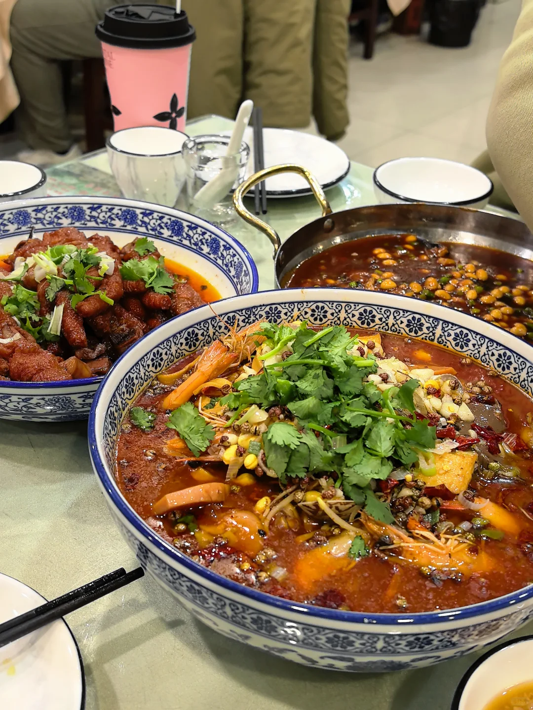

- 小红书：[无标题（正文开头：连云港新兴园土菜馆：7分） · 白夜行](https://www.xiaohongshu.com/explore/6935a875000000001e027c00)。亲开当前笔记暂时无法浏览/App扫码查看，搜索入口无标题正文可读
- 点评：[具体门店](https://www.dianping.com/shop/k8CvzhWDurk4wgg1)。实际搜索唯一新兴园土菜馆取得真实链接再亲开正常
- 高德：[地点](https://www.amap.com/place/B020600X51)。从公开榜单实际点击取得POI后Chrome亲开正常
- 图像原文件 SHA256：42ed94161a632e0f64190d742ba01b97f6f0bc8a5c93c105b5cc9f6367da2420，1080×1440。大碗海鲜汤菜、旁边鸡爪与铁板菜，与同一餐的正文菜品对应。

## 连云港 · 兄弟酒家

等级：caution。海昌路分店XHS明确，点评当前时间表与地图地址匹配；可有条件正餐备选，近期投诉大厅吸烟喧闹和排队服务，未达必去

- 小红书：[连云港老店新吃之兄弟酒家 · 能能](https://www.xiaohongshu.com/explore/6a69ee72000000001101ec3c)。Chrome实际单独打开当前笔记暂时无法浏览，需扫码App；签名搜索可读
- 点评：[具体门店](https://www.dianping.com/shop/kaJfhd7VbRgRNPX0)。Chrome实际搜索海昌路分店获得真实链接并亲开
- 高德：[搜索备选](https://www.amap.com/search?query=连云港兄弟酒家海昌路店)。Chrome亲开显示唯一同名海昌路店
- 图像原文件 SHA256：1c7586eaf1978b95a6e9b3f24e30d65fff0fbf497d891f10132aed127e2c3b41，1440×1080。root逐张查看实际原文件：鱼籽青椒小碗旁吊饼，背景海蜇黄瓜菜，与专帖海昌路店餐食描述匹配；照片本身不证明具体分店，分店仍依赖正文及平台核验。

## 连云港 · 徐凤芹酸辣粉

等级：exclude。实际可读多帖和原图齐全，但分店匹配与营业未确认，口味争议明显，先保留候选不做确定推荐

- 小红书：[连云港|徐凤芹大嘴巴酸辣粉🍜 · 大鳄鱼](https://www.xiaohongshu.com/explore/6a3b3a99000000001702907f)。Chrome单独亲开当前笔记暂时无法浏览要求扫码App，签名搜索可读
- 点评：[具体门店](https://www.dianping.com/shop/Ha8u3yCo9Po0lxYe)。Chrome实际搜索取得民主路店真实链接并亲开可读
- 高德：[搜索备选](https://www.amap.com/search?query=连云港徐凤芹酸辣粉民主路店)。Chrome实际搜索显示唯一同名民主路分店
- 图像原文件 SHA256：59f5959e3a1906fe6d07a89ada6d1cde1078db4c8248a53a180d14e8be1ba62d，1080×1080。本地view_image核查炸肉及鱿鱼串、酸辣粉白碗红汤肉丝香菜和徐凤芹橘红纸杯部分logo，匹配正文实吃

## 连云港 · 红双喜海鲜·盐河宴·连云港菜

等级：optional。当前具体点评分店营业已核，照片吻合；无互动与地图详情，不列必去

- 小红书：[连云港吃喝记录第2️⃣9️⃣弹 红双喜·盐河宴 · 哈利波菜](https://www.xiaohongshu.com/explore/6a88409800000000160252ed)。Chrome亲开web_error_page导航壳，没有笔记正文
- 点评：[具体门店](https://www.dianping.com/shop/k5ItaAlI6Yy7GTgM)。实际搜索唯一盐河宴并打开
- 高德：[搜索备选](https://www.amap.com/search?query=连云港红双喜盐河宴)。亲开并Enter搜索，页面可读无门店结果
- 图像原文件 SHA256：48b3f681017e49eb0c156debee27cd0bdead74444fd79e2d36095b6d9e812561，1080×1080。捞汁海鲜、虾球腰果、狮子头、豆腐煲及红双喜盐河宴原店名文字，与正文对应。

## 连云港 · 正兵饭店

等级：caution。点评实测营业可见，主帖自然分享，但高德验证阻断且分店匹配未完成，有环境排队争议

- 小红书：[连云港正兵饭店，爆好吃 · 谭谈弹](https://www.xiaohongshu.com/explore/6999d754000000001a022bb9)。Chrome亲开当前笔记暂时无法浏览，要求扫码App；签名搜索可读
- 点评：[具体门店](https://www.dianping.com/shop/Hal7MYUCnoU4OOyK)。Chrome实际搜索取得真实门店链接，亲开可读
- 高德：[搜索备选](https://www.amap.com/search?query=%E8%BF%9E%E4%BA%91%E6%B8%AF%E6%AD%A3%E5%85%B5%E9%A5%AD%E5%BA%97)。Chrome亲开出现滑块验证，未操作已报告root
- 图像原文件 SHA256：f9a4c4edd59a88a4f1d6e2db8c1c65c443712e7c291204af0e7db0f3636d039e，1440×1080。本地view_image核查为白盘虾滑青笋木耳汤，与正文虾滑笋片汤匹配

## 日照 · 海鲜豆腐园

等级：caution。门头号码和高德吻合、两平台当前营业齐，但近期顾客鱼类品质及性价比体验冲突需先核对；作为需先核对的候选，不计已充分核实的推荐。

- 小红书：[日照｜➡️海鲜豆腐园 · 大向妹儿](https://www.xiaohongshu.com/explore/6a4c60b80000000022018606)。独立实际开规范链接显示当前笔记暂时无法浏览，请打开App扫码；搜索正文与LIVE独立静态原图可读。
- 点评：[具体门店](https://www.dianping.com/shop/k3q1njWbcsOJDNgy)。真实日照站内搜索唯一原石臼市场店，实际开详情营业中09-22。
- 高德：[搜索备选](https://www.amap.com/search?query=%E6%97%A5%E7%85%A7%E6%B5%B7%E9%B2%9C%E8%B1%86%E8%85%90%E5%9B%AD)。真实搜索唯一同名点击展开详情，未取得place ID，保留实际搜索链接；营业中09-22，门头13863347216与实际高德电话一致。
- 图像原文件 SHA256：8682e8948b932f288ca5c59a61500eb0f9470de984135a76f1257db1bfceb832，1080×1440。黄色海鲜豆腐园门头，原石臼市场店及电话13863347216可见。

## 日照 · 馥麦烘焙

等级：optional。独立顾客专店实吃与品牌原图、两平台新城花园同址当前营业、近期记者地域依据支持条件可选。主帖无精确门牌、缺近3月差评范围，不升必去。

- 小红书：[日照·馥麦面包店🍰 · 辣糖](https://www.xiaohongshu.com/explore/69a00dfb000000001a02e985)。Chrome单独打开当前笔记暂时无法浏览/App扫码；搜索入口实际正文照片可读。
- 点评：[具体门店](https://www.dianping.com/shop/H5qkT8LgtowDCwTv)。Chrome站内实际搜索唯一馥麦烘焙新城花园店并打开详情，营业中09-21。
- 高德：[搜索备选](https://www.amap.com/search?query=%E6%97%A5%E7%85%A7%E9%A6%A5%E9%BA%A6%E7%83%98%E7%84%99)。真实搜索唯一新城花园店并点击详情；未获取规范place ID，保留合法搜索链接。详情09-21，2/16-2/20历史关闭不影响10月。
- 图像原文件 SHA256：54ac0f026b7339fab5c84e6db2d3ff94b453faa725a83f90bb4901ce6f57fb7b，1080×1440。root实看两层奶油蛋糕，上有焦糖布蕾和灯笼果，品牌牌/底板Fullmarket馥麦及彩色鸟包装完整可见，符合本店专帖订蛋糕实物；不凭蛋糕确定具体门牌。

## 日照 · 夫妻美食

等级：caution。主帖详细负面、第二专帖评论多项反驳，与高德旧好评有分歧；原图门头、地址、营业齐全，缺近3月点评差评范围，列慎去。

- 小红书：[日照美食探店—夫妻美食 · 好吃爱吃能吃](https://www.xiaohongshu.com/explore/69ed5e08000000002202736f)。Chrome单独打开显示当前笔记暂时无法浏览、请App扫码；搜索入口正文照片评论可读。
- 点评：[具体门店](https://www.dianping.com/shop/l89nIiLqhg7k5J0q)。Chrome实际搜索唯一店取得并打开，详情摘要可读。
- 高德：[地点](https://www.amap.com/place/B0FFJURZZZ)。来自已存真实候选place链接，Chrome本轮亲测详情可读。
- 图像原文件 SHA256：1356be7be699dc815a99213bb9ee96096dd2cc3f381877aa7922b4dc2ebcfb31，1440×1080。本地view_image核实红底黑字夫妻美食门头，右上石臼所老街，20年老店、2005.8.15开业与09:00-20:30牌，菜牌含米肠冷面拌饭。DOM swiper index=0。

## 日照 · 胡家猪蹄店

等级：optional。明确海纳对面专帖实吃原图、长期日照用餐作者、地图同址当前营业可选，负面反查相关帖实际指大学城未名摊，不误归胡家。点评只能真实搜索fallback，缺近3月差评不升必去。

- 小红书：[日照｜胡家猪蹄 · 请叫我大王](https://www.xiaohongshu.com/explore/69fdb3f2000000003601cf2e)。Chrome单独打开当前笔记暂时无法浏览/App扫码；搜索入口实际正文照片可读。
- 点评：[搜索备选](https://www.dianping.com/search/keyword/153/0_%E8%83%A1%E5%AE%B6%E7%8C%AA%E8%B9%84)。2026-10-01 Chrome亲测搜索0匹配，推荐列表非本店，不能借评分。
- 高德：[地点](https://www.amap.com/place/B02790OVBM)。Chrome直接打开真实place入口详情可读，已亲核当前营业与地址。
- 图像原文件 SHA256：261425598081840706c6c6bc7d9ebc0bea65a49924396ef03e3e0e887ce48fd7，1080×1440。root实看原文件为白盘切块卤猪蹄、木桌及青花茶杯，符合专帖该餐；正文明确海纳对面，地图对应黄海一路店。图片无店牌，不能只凭盘子证明分店。

## 日照 · 葭窑面包JiaYao

等级：optional。真实实吃及DP/Gaode位置营业可核对，但本地居民身份有限、口味偏甜争议，近期差评未完整读取，不列必去。

- 小红书：[面包测评|日照葭窑，你为什么要谋害朕😱 · 熊猫🐼（减脂版）](https://www.xiaohongshu.com/explore/694de02d0000000022031a44)。单独Chrome打开显示暂时无法浏览、请打开App扫码查看；搜索入口正文评论可读。
- 点评：[具体门店](https://www.dianping.com/shop/iqi6uRitMEUMhUuA)。Chrome实际搜索取得唯一店铺并单独打开详情可读。
- 高德：[搜索备选](https://www.amap.com/search?query=%E6%97%A5%E7%85%A7%E8%91%AD%E7%AA%91%E9%9D%A2%E5%8C%85)。Chrome合法搜索唯一葭窑面包，点击打开详情已读；未取得place canonical。
- 图像原文件 SHA256：ddc3061c1b106f8e5e32caac28fe652e053e9f755a1ba64a995711b5832a3982，1080×1109。本地view_image核对：整桌塑封面包甜点，杏仁片薄酥、盒装吐司、布丁塔等；包装袋有葭窑标识，与主帖邮购清单对应。DOM data-swiper-slide-index=0明确第一张。

## 日照 · 临沂金来糁馆

等级：optional。专店正文评论主页、原门头、两平台营业地址齐，但旧XHS内容简短且无评论，本地口碑与近3月差评范围不足，列可选。

- 小红书：[日照 / 临沂金来糁馆 · 戊空咸鱼](https://www.xiaohongshu.com/explore/63589615000000001502f8c7)。单独Chrome打开显示暂时无法浏览、请App扫码，搜索入口可读。
- 点评：[具体门店](https://www.dianping.com/shop/k1w2glxPSegxpQaS)。Chrome真实搜索唯一店取得链接并亲测详情。
- 高德：[地点](https://www.amap.com/place/B0FFFPAN9M)。 inherited真实候选place入口Chrome亲测可读，web工具本轮不可访问与Chrome可读分别记录。
- 图像原文件 SHA256：876df9ef90a9a55e84272faf0a50e43cd2c29b5189da8678930df6d878fa80ca，1080×1439。本地view_image实核红底黄字临沂金来糁馆门头，早餐午餐字样，电话15166171589与高德相同，店身份直接匹配。DOM swiper index=0。

## 日照 · 巨峰大集羊汤

等级：caution。明确旗舰店与当前营业齐，但高频探店营销倾向和近期同品牌未收束投诉需先核对；作为需先核对的候选，不计已充分核实的推荐。

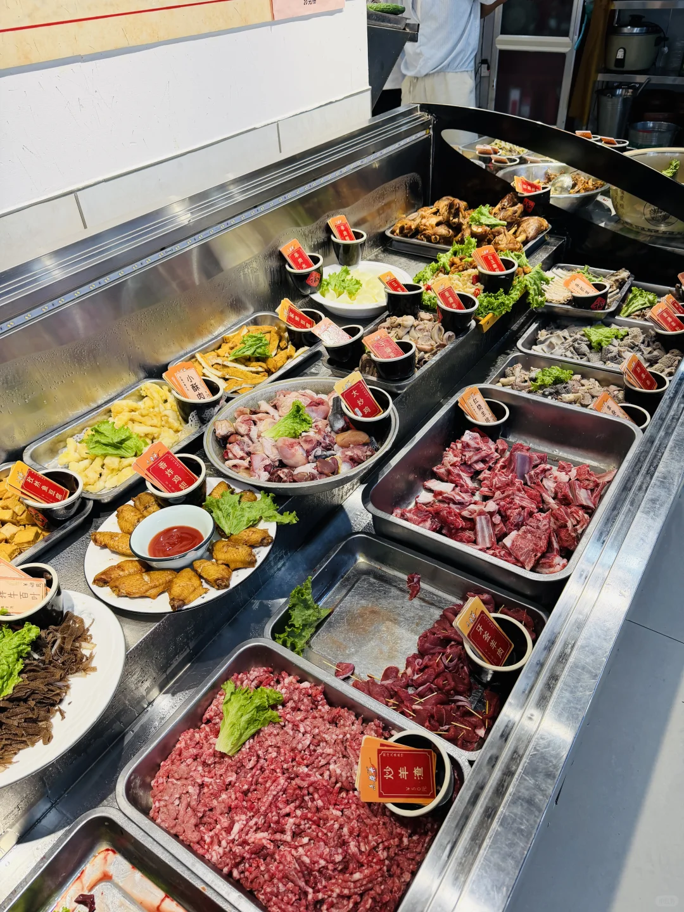

- 小红书：[日照巨峰大集羊汤｜本地羊汤真的香迷糊✨ · 蒸蒸](https://www.xiaohongshu.com/explore/6a815a910000000022010783)。单独开规范链接显示当前笔记暂时无法浏览，请打开App扫码；搜索入口真实正文与独立LIVE静态原图可读。
- 点评：[具体门店](https://www.dianping.com/shop/k3Zh1k3Kokn8wkyD)。站内真实搜索5结果，选明确日照旗舰店并实际开详情，休息中10-14:30/17-21:30。
- 高德：[搜索备选](https://www.amap.com/search?query=%E6%97%A5%E7%85%A7%E5%B7%A8%E5%B3%B0%E5%A4%A7%E9%9B%86%E7%BE%8A%E6%B1%A4%E6%97%97%E8%88%B0%E5%BA%97)。真实搜索唯一旗舰店并点击详情，未取得place ID，保留合法搜索链接；当前营业安排10-14:30/17-21:30。
- 图像原文件 SHA256：25b37003dd9b843fbb19baaf97475b74e7c7beb6175092c2c9dbbc2afd834420，1080×1440。羊肉羊杂与多道炒菜的开放选菜柜，红色菜牌实拍；具体旗舰店依正文，非图像单独证明。

## 日照 · 坤记熏酱大冷面

等级：caution。专帖实吃与原图齐全，两平台营业时间一致且为唯一搜索店，但主帖无明确门牌、点评与高德地址写法不同；较多一般/偏甜偏咸反馈，作为需先核对的候选，不计已充分核实的推荐。

- 小红书：[坤记大冷面 · 请叫我大王](https://www.xiaohongshu.com/explore/69e98a48000000001a0301b9)。Chrome单独打开当前笔记暂时无法浏览/App扫码；搜索入口实际正文照片可读。
- 点评：[具体门店](https://www.dianping.com/shop/H9bZn7MYDtxqduRv)。2026-10-01 Chrome真实站内搜索唯一店并打开详情，休息中11:30-14:00、17:00-21:30，秦皇岛路111号。
- 高德：[地点](https://www.amap.com/place/B0K6JHTNPV)。Chrome真实详情当前营业时间可读，周二至周日11:30-14:00、17:00-21:30。
- 图像原文件 SHA256：9cd3ddf2fdf7ff116d05f928a5717eacc5f5ed4510bdf967367e78ed8b40ef40，1080×1102。root实看白盘锅包肉近景，胡萝卜丝及少量绿叶、木桌边缘可见；与坤记单店专帖锅包肉餐食描述相符。照片无店牌，不以食品外观确认具体街号或分店。

## 日照 · 老博菜馆

等级：optional。门头、同名唯一门店及当前营业相符，主帖及评论者背景已读；可选但口味两极，非必去，也不作口味或卫生保证。

- 小红书：[老博菜馆 5颗星🌟🌟🌟🌟🌟 · 小钢炮](https://www.xiaohongshu.com/explore/6a4bb5500000000021009c23)。实际单独开规范链接显示当前笔记暂时无法浏览，请打开App扫码；搜索正文可读，原图独立下载。
- 点评：[具体门店](https://www.dianping.com/shop/H8JE4OR1zDdu5icR)。真实站内日照搜索唯一老博菜馆，实际开详情休息中附11-14/17-21，非暂停营业。
- 高德：[地点](https://www.amap.com/place/B0JU29FQ5E)。实际开详情，休息中附11-14/16:30-21；地址与点评相同。
- 图像原文件 SHA256：0d2b7368d79f053a9b71f0b8d7e4375e0d4fbb7fb2ae5aa757931411bee33167，943×707。白格红字老博菜馆门头，旁有羊棒骨字样，无街道门牌。

## 日照 · 老东方水饺海鲜城

等级：exclude。点评当前页面明示商户暂停营业；高德没有精确同名结果，缺当前营业确认。

- 小红书：[日照旅游｜本地人推荐 老东方水饺海鲜城 · 馨心_baby](https://www.xiaohongshu.com/explore/68affe7e000000001b020fc3)。Chrome亲测canonical暂时无法浏览，App扫码提示；签名搜索入口正文可读。
- 点评：[具体门店](https://www.dianping.com/shop/9483943)。此前真实照片页取得shop入口；Chrome亲测店页可读。
- 高德：[搜索备选](https://www.amap.com/search?query=%E6%97%A5%E7%85%A7%E8%80%81%E4%B8%9C%E6%96%B9%E6%B0%B4%E9%A5%BA%E6%B5%B7%E9%B2%9C%E5%9F%8E)。Chrome合法地点搜索亲测可读。
- 图像原文件 SHA256：26b06a0efc12255bfe1d01b978650e43fd85a044462921eb9796ccb93d4f09e8，1080×1440。本地view_image核对实际原文件：绿色门头红字“老东方水饺海鲜城”，可见海鲜加工、海肠捞饭、鲅鱼水饺等招牌。本店身份直接匹配；不是此前截图显示的餐盘。

## 日照 · 临福记锅贴·糁

等级：caution。两平台当前营业且地址相近，但XHS无门牌、现名和营业时段不一致；作为需先核对的候选，不计已充分核实的推荐。

- 小红书：[日照早餐 临福记锅贴·糁 · 月亮打烊了](https://www.xiaohongshu.com/explore/688998430000000004001cee)。独立规范链接实际显示当前笔记暂时无法浏览，请App扫码；搜索正文及独立静态WebP可读。
- 点评：[具体门店](https://www.dianping.com/shop/k2DViJ894lksJLSD)。真实日照搜索3结果，打开临福记锅贴糁海滨五路店，营业中06-23；XHS主帖无门牌不标已确认同分店。
- 高德：[地点](https://www.amap.com/place/B0K2A5QQY7)。实际打开临福记锅贴海鲜大排档，营业中06-21:30，电话17864006780；24小时标签与具体时段矛盾保留。
- 图像原文件 SHA256：00c1cfbf15e2db481f8aa4d98a907567b36ed7ad3ca9e49a7e3c562b85469439，1080×1440。锅贴、油条、鸡蛋及肉汤；保留原贴纸，无门牌，分店仍待核。

## 日照 · 门师傅鸡蛋饼

等级：caution。原图与近期实吃、两平台营业已实读；嘉阳路与昭阳路定位差异待核，作为需先核对的候选，不计已充分核实的推荐。

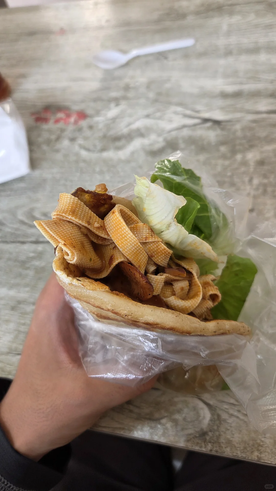

- 小红书：[今天吃了门师傅鸡蛋饼 · 橘子皮](https://www.xiaohongshu.com/explore/6abcdbcb000000001402c090)。单独打开当前笔记暂时无法浏览，请打开App扫码查看；搜索入口正文与静态原图实际可读。
- 点评：[具体门店](https://www.dianping.com/shop/H8Bu2pMxGhzuMOh7)。站内实际搜索唯一昭阳居民区店并打开，休息中次日05:30开始营业。
- 高德：[地点](https://www.amap.com/place/B0FFHLG32V)。实开详情休息中05:30-14:00，仍为有营业安排的店铺。
- 图像原文件 SHA256：107f5f91eb4100f781ecfae4faa3204cb8dc5a9115d95bfd415d9358a197b144，1080×1918。手持饼夹豆皮、生菜及肉；匹配鸡蛋饼实吃，图无店牌，嘉阳与昭阳差异仍需核。

## 日照 · 面老怪辣子鸡拌面

等级：optional。XHS明确大学城及店面、点评大学城同址与高德总店营业核对；可选但保留旧口味服务负面和排队限制，非必去。

- 小红书：[面老怪辣子鸡面5颗星🌟🌟🌟🌟🌟 · 小钢炮](https://www.xiaohongshu.com/explore/6a6b3f3c000000002500945c)。实际独立开规范链接显示当前笔记暂时无法浏览，请打开App扫码；搜索正文与静态原图正常可读。
- 点评：[具体门店](https://www.dianping.com/shop/k6ClVDf2khrlMzNm)。真实日照搜索5门店，选大学城结果实际开详情营业中09:30-22:30。
- 高德：[地点](https://www.amap.com/place/B0GKS4GDFD)。实际详情地址同点评，营业时间周一至日09:30-22:30，春节关闭特例已经过去。
- 图像原文件 SHA256：7d9c6fa3c26701a88e30498e26e53dc11d48a8ce45cfb90601a6a1e22696bc43，1260×944。白底红字面老怪辣子鸡拌面店牌清晰。

## 日照 · 潘记手工打面

等级：optional。实吃正文明确大学城夜市旁、门头潘记与高德东升园定位匹配；高德营业中10-22，可按偏硬粗面口味选择，保留海鲜吐沙和旧卫生意见。点评分店不匹配未混用，不列必去。

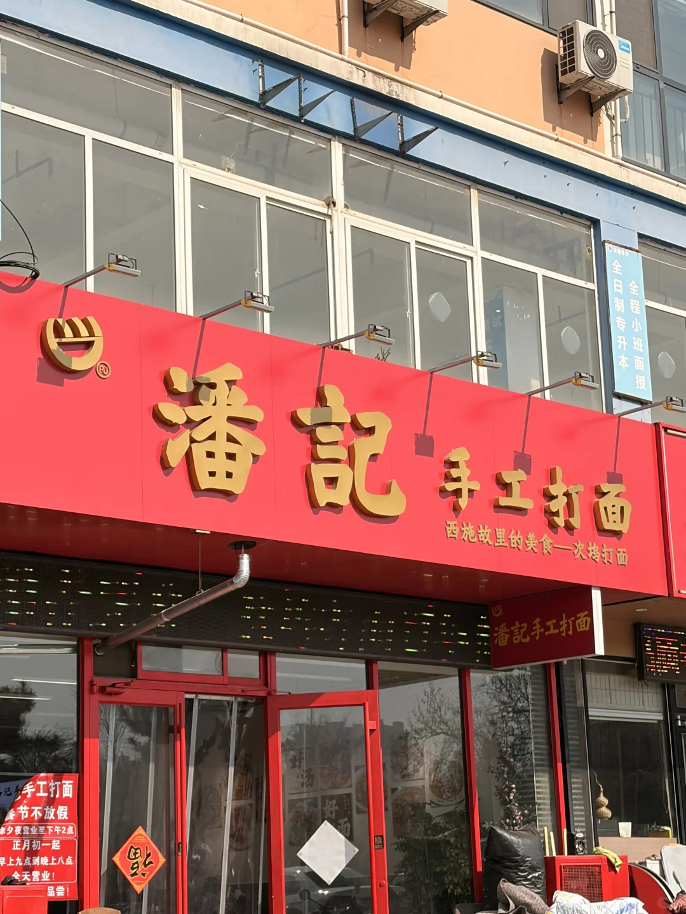

- 小红书：[在日照·潘记打面 · ansvar](https://www.xiaohongshu.com/explore/6995401b000000001a022be7)。实际独立打开规范链接当前笔记暂时无法浏览，请打开App扫码；搜索正文及网站静态图正常可读。
- 点评：[具体门店](https://www.dianping.com/shop/l844Ma8qF7qx9CrX)。真实日照搜索只找到财富广场分店，实际详情可读；不同分店不可确认东升园营业。
- 高德：[搜索备选](https://www.amap.com/search?query=%E6%97%A5%E7%85%A7%E6%BD%98%E8%AE%B0%E6%89%8B%E5%B7%A5%E6%89%93%E9%9D%A2)。实际搜索3分店，选择东升园详情；营业中10:00-22:00，18368558080。未取得placeID不构造。
- 图像原文件 SHA256：16b57fc03e02bf262785823feb0208c4c15e426dc04b7af8cc6ec2c9c6b20128，1080×1440。红底金字潘记手工打面门头、副字次坞打面可见，无街道门牌。

## 日照 · 世起全羊

等级：caution。两平台太原路51号当前营业相符，实读多篇日照同品牌实吃原图，但XHS门牌未收束，作为需先核对的候选，不计已充分核实的推荐。

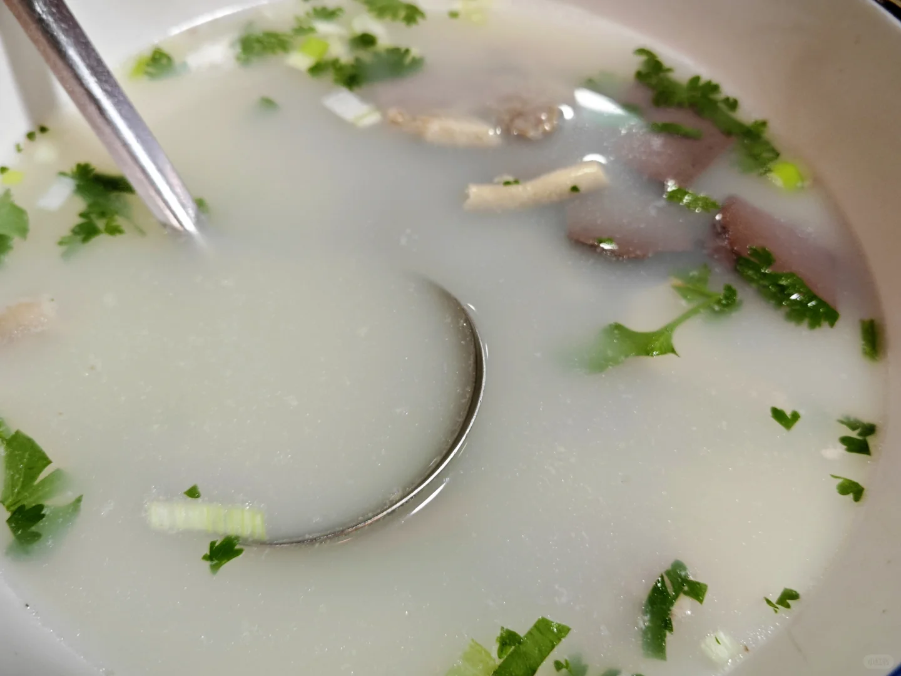

- 小红书：[日照 世起全羊 B+级 · 有毛不易](https://www.xiaohongshu.com/explore/6abd22ff000000001c01c148)。单独开规范链接显示当前笔记暂时无法浏览，请打开App扫码；站内搜索正文与原图实际可读。
- 点评：[具体门店](https://www.dianping.com/shop/H2wfHlCzCm0rsVDy)。从实际Web店铺图片结果取得shop ID并Chrome实际打开详情，营业中10-21。
- 高德：[地点](https://www.amap.com/place/B0FFFPA7VZ)。实际门店详情，休息中09:30-14:30、16:30-21；并非停业。
- 图像原文件 SHA256：f821124bad7b87cafb7d2db7cb3a0ffdfe8d0b83310a3cc2a1388310946e36a6，1440×1080。白碗羊汤、香菜、羊杂和金属汤勺，匹配羊汤专帖；门牌未仅凭图片确定。

## 日照 · 天瑞原创菜

等级：caution。XHS分店不明，多平台口碑争议，不满足必去证据。

- 小红书：[来日照一定要避雷天瑞原创菜！！ · 铁锤妹妹](https://www.xiaohongshu.com/explore/6a65c479000000000f030656)。Chrome无签名链接显示当前笔记暂时无法浏览、请打开App扫码；签名搜索入口全文可读。
- 点评：[具体门店](https://www.dianping.com/shop/G7e9vnj1LtTMm10b)。Chrome从真实搜索结果取得并亲自打开。
- 高德：[地点](https://www.amap.com/place/B0FFJ1O8D1)。Chrome亲测详情可读
- 图像原文件 SHA256：4aadb7153d66e84ba9dc1ba92496fa20201ddca3e360ba7e7f18ec09f0d3e0e2，1080×1435。本地view_image核对木盘鱼渣配大葱与金属勺，和帖中餐图匹配；无店牌所以分店有限。

## 日照 · 雅宏炒面

等级：optional。明确分店专帖和图上店名，与DP/高德同名云海路99号匹配，两平台显示仍经营。街边环境与服务评分一般、近期评论覆盖不足，作为条件可选不升必去。

- 小红书：[日照美食｜雅宏炒面（啤酒厂家属院店） · 抠抠唧唧（日常碎碎念）](https://www.xiaohongshu.com/explore/66420249000000001e01ef32)。Chrome单独打开当前笔记暂时无法浏览/App扫码；搜索入口实际正文照片可读。
- 点评：[具体门店](https://www.dianping.com/shop/iYGTTbMZLoL3PHed)。Chrome真实站内搜索唯一啤酒厂家属院店，直接详情可读，休息中11:00-14:00、16:00-20:30。
- 高德：[地点](https://www.amap.com/place/B0FFGMVL9A)。Chrome实际详情营业中10:00-21:00，电话13646333336，与XHS/点评明确同分店。
- 图像原文件 SHA256：830c2d2eb2f5fdba4da03b7a3bc7cd10d8036f3ce143a4573ab20dcb7c283f66，1440×1080。root实看两盘鸡蛋火腿炒面/炒粉配大片豆干，图中文字明确雅宏炒面（啤酒厂家属院店）；左侧烤串与右侧凉拌菜在正文为邻店产品，不当雅宏菜品。原作者完整注释及原图保留。

## 日照 · 宜嘉香肉火烧

等级：optional。专店实吃和两平台营业位置核对齐；口味分化、非本地居民确认、DP完整近3月差评未读，列可选。

- 小红书：[日照｜宜嘉香肉火烧 · 每天吃饱饱](https://www.xiaohongshu.com/explore/6a8a559c000000003302bd28)。Chrome单开显示暂时无法浏览、请App扫码；搜索入口正文可读。
- 点评：[具体门店](https://www.dianping.com/shop/HavhqQz13uAAYSO5)。Chrome真实搜索唯一宜嘉香日照店，亲自打开详情。
- 高德：[地点](https://www.amap.com/place/B0FFFPA80Y)。真实web来源取得place，Chrome亲测详情。
- 图像原文件 SHA256：1c7f9ec444c34bbea9a5349c9f8d00e30f1e036046c3acb99a3f334978c63d5d，1080×1419。实际原图为三只火烧与豆浆咸菜，符合单店实吃正文；保留平台原图。

## 芜湖 · 二姐红豆

等级：caution。具体双桐巷分店由专帖店牌与点评匹配，当前点评明确营业；口味/服务争议较多且近期差评范围不完整，定慎去而非必去。

- 小红书：[芜湖二姐红豆，强烈推荐！ · 我就是大能猫](https://www.xiaohongshu.com/explore/68287803000000002200607c)。auxTab单独亲开canonical显示当前笔记暂时无法浏览、请打开App扫码查看；搜索入口正文可读
- 点评：[具体门店](https://www.dianping.com/shop/3086791)。2026-10-01原生已登录Chrome主店可读；查看全部评价点击弹App扫码，未继续
- 高德：[地点](https://ditu.amap.com/place/B022900G2X)。已亲开具体双桐巷店可读地址；未显示营业字段
- 图像原文件 SHA256：d3d7568cde78ac12f583e0159402322dd1cefce09df9d594e04e738a94365c4f，1080×1440。root实看原文件为手持透明杯红豆酒酿，底部红豆及金属勺，木桌红白砖背景；专帖首张店牌明确双桐巷店，饮品与正文餐食及同帖现场相符，照片本身不单独证明分店。

## 芜湖 · 耿福兴

等级：exclude。XHS专帖/作者主页/0评论已读，正确食物原图经本地view_image复核；具体分店点评/地图及营业未知，暂不推荐。

- 小红书：[芜湖探店 | 老字号耿福兴，不吹不黑 · 22](https://www.xiaohongshu.com/explore/69e07f64000000001a03047c)。Chrome独立打开显示当前笔记暂时无法浏览、请打开App扫码；搜索签名入口正文实读成功
- 点评：[搜索备选](https://www.dianping.com/search/keyword/111/0_%E8%80%BF%E7%A6%8F%E5%85%B4%E5%8F%A4%E5%9F%8E%E5%BA%97)。古城直店未取得；web.open正常搜索入口实测不可访问
- 高德：[搜索备选](https://www.amap.com/search?query=%E8%80%BF%E7%A6%8F%E5%85%B4%E8%8A%9C%E6%B9%96%E5%8F%A4%E5%9F%8E%E5%BA%97)。web.open正常地点搜索入口不可访问，未取得古城具体门店
- 图像原文件 SHA256：aeb66289e0379e40afc78d48ac02328c77b11419a84a9a19c7558f246d6c4296，1080×1440。2026-10-01 view_image亲看本地下载文件：白盘内切块红皮鸭浸甜卤汁，木桌背景；本文作者明确耿福兴古城店，与正文红皮鸭子匹配。

## 芜湖 · 口福汤包

等级：exclude。点评当前营业已确认，但XHS原图分店仍未完全明确，且有9月6日餐具/服务个人投诉，保留exclude待明确分店及更多当前质量证据。

- 小红书：[逛吃逛吃—芜湖口福汤包馆 · kokjy](https://www.xiaohongshu.com/explore/6a0c65c00000000007010a78)。auxTab单独亲开canonical显示当前笔记暂时无法浏览/请App扫码；搜索入口正文可读。
- 点评：[具体门店](https://www.dianping.com/shop/13804755)。2026-10-01原生Chrome具体融汇主店可读营业和近期评价
- 高德：[地点](https://ditu.amap.com/place/B0FFFH9YF1)。亲开具体融汇店可读
- 图像原文件 SHA256：6091fc0c76ece77c7f875de49282df08e90e16402a28c855e8db14017c4c18a1，1080×1440。已本地view_image确认两笼汤包、鸭肉盒、煮干丝和饮品在木桌，图中文字口福汤包馆，与专帖实吃场景一致；具体分店仅正文步行街描述，未过度确认。

## 芜湖 · 四季春

等级：optional。原帖首张店面与实际点评美食街店门面分类中两层木廊、上下双匾、龙纹横梁与玻璃门布局一致，结合点评当前地址营业确认分店；适合早茶少量点单，午后菜品限制及服务问题如实提醒，未升必去。

- 小红书：[芜湖美食探店——四季春 · Ruan](https://www.xiaohongshu.com/explore/684ef71800000000120006ee)。Chrome独立打开显示当前笔记暂时无法浏览，请打开App扫码查看；签名搜索入口正文实读成功
- 点评：[具体门店](https://www.dianping.com/shop/l8LT4M6pQlHl4R0O)。2026-10-01原生Chrome从既有照片页店名链接点击主店，当前营业和评价可读
- 高德：[地点](https://www.amap.com/place/B02290HXJG)。亲开可读四季春美食街店及凤凰美食街1号，无当前营业时间
- 图像原文件 SHA256：1f38bb7b28d4dab5d69805c78efd03c3ff23a0240e31f1fa8fe48f7962fd1755，1080×1440。view_image本地亲看：白碗虾籽面，面上褐色虾籽、汤中葱段，金属桌面；同专帖首图四季春店牌，正文吃面对应。

## 芜湖 · 小高渣肉蒸饭

等级：caution。老一中明确分店和原图已核，当前同分店原生点评确认营业；有独立比较帖支持同时有餐具残渣个人反馈、推广号风险和偏干口味争议，定慎去，未作卫生事实或全3月差评通过。

- 小红书：[小高渣肉蒸饭 · 皖美食客](https://www.xiaohongshu.com/explore/69f6ba2b00000000350325d0)。auxTab单独亲开无参canonical显示当前笔记暂时无法浏览/打开App扫码；搜索签名入口正文可读。
- 点评：[具体门店](https://www.dianping.com/shop/4281767)。2026-10-01原生已登录Chrome从照片页店名实际link点击进入主店，当前营业与近期评价可读
- 高德：[地点](https://www.amap.com/place/B0FFLJMPW7)。2026-10-01 web.open亲开具体地点可读
- 图像原文件 SHA256：56fe68d9fad76c08ac4c70e12bf69f2e4ce4637b4dd444f057545bd58ca3f872，1050×1331。实际原图为粉蒸肉、千张与糯米饭，后方豆腐脑；店铺关联以单店正文为依据，图片无分店牌。

## 芜湖 · 小金蒸饭

等级：exclude。当前平台营业已确认，主XHS专帖与原图具体荟萃中学分店仍未明确，保留exclude至补分店证据；不因高德缺营业忽视点评已确认。

- 小红书：[20260522 芜湖 小金蒸饭 · 张三](https://www.xiaohongshu.com/explore/6a1e8a86000000002101be0f)。独立Chrome打开显示当前笔记暂时无法浏览/请打开App扫码；签名搜索入口正文可读
- 点评：[具体门店](https://www.dianping.com/shop/2555635)。2026-10-01原生Chrome主店可读当前营业和评价
- 高德：[地点](https://www.amap.com/place/B0FFH0QXLB)。web.open实际地点可读
- 图像原文件 SHA256：442188d21525ae5734bd19babfde0420f1f560d4886cdff135d2faa6dcc7efef，1440×1080。专帖左侧静态图为竹笼中粉蒸肉覆盖糯米豆皮的渣肉蒸饭，与小金帖正文匹配；分店未明确。

## 芜湖 · 晓马鸭店

等级：exclude。同分店当前点评营业已确认；主帖照片具体新芜路分店归属仍待明确，保留exclude，避免跨分店误配。

- 小红书：[芜湖晓马鸭店很好，但不会再去了 · 一只喵虎](https://www.xiaohongshu.com/explore/687df8390000000012015682)。Chrome独立打开显示当前笔记暂时无法浏览、请打开App扫码查看；搜索签名入口正文实读成功
- 点评：[具体门店](https://www.dianping.com/shop/23892639)。2026-10-01原生Chrome主店可读当前营业和9月评价
- 高德：[搜索备选](https://www.amap.com/search?query=%E8%8A%9C%E6%B9%96%E6%99%93%E9%A9%AC%E9%B8%AD%E5%BA%97%E6%96%B0%E8%8A%9C%E8%B7%AF)。精确店点未找到；web.open实际搜索入口不可访问
- 图像原文件 SHA256：263d8711281dbca84ca0547d539c0f1b54274a925ae91165c9871a7293051134，1080×1440。view_image本地亲看白盘红皮鸭、鸭杂面与香菜血块汤，木桌背景；匹配本专帖晓马红鸭自驾实吃，具体分店未明。

## 淮安 · 老字号八宝粥

等级：caution。明确西大街专帖、食物和门头电话与高德同址吻合，两平台当前营业；个人口味对甜度分歧明显，近期点评缺口保留

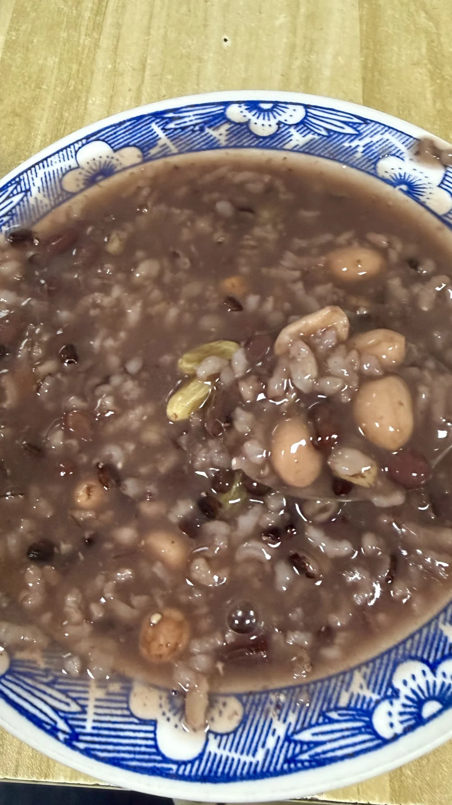

- 小红书：[淮安平平无奇但是特别好吃的八宝粥 · 老皮皮小颖](https://www.xiaohongshu.com/explore/6a1c2615000000003601b7da)。清洁主帖公开链接实际打开当前笔记暂时无法浏览需App扫码，搜索入口可读
- 点评：[具体门店](https://www.dianping.com/shop/iJLkbEsbKrDqOp8e)。淮安正常站内搜索取得西大街店并亲开4.5/212条/23元，营业中15-21
- 高德：[地点](https://www.amap.com/place/B0FFHYKZGF)。正常SSR查询及可见城市淮安选择后出现本店，亲开详情取得ID并亲开place；4.6/4评价/15元，营业中14:30-21
- 图像原文件 SHA256：c859c13cc7626a283c5d63b248c9f7154b7104a3ec53e72f63759483492df890，1080×1920。青花碗里杂粮粥、豆类与花生清晰，无店牌，依同帖证据匹配。

## 淮安 · 陈五蟹黄汤包

等级：caution。真实点评当日营业，多篇品牌实吃原图与赞贬可读；街号分店未独立确认，近期评价缺口，谨慎候选不计严格推荐

- 小红书：[淮安陈五蟹黄汤包 · 今天也要早睡呀](https://www.xiaohongshu.com/explore/681623dd00000000090165b7)。无签名公开链接实际打开当前笔记暂时无法浏览/App扫码，搜索专帖正文可读
- 点评：[具体门店](https://www.dianping.com/shop/79586087)。真实附近商户链接获取，亲开4.1/684条/51元/营业中07-20/胯下东街78
- 高德：[搜索备选](https://www.amap.com/search?query=%E9%99%88%E4%BA%94%E8%9F%B9%E9%BB%84%E6%B1%A4%E5%8C%85)。真实搜索可读但默认杭州，结果均杭州其他汤包店，未匹配淮安本店，未改定位猜ID
- 图像原文件 SHA256：c0dfed71a09f2afcfc547fb45552a7689ccc15f95d34e737e1a8e57c213af94a，1080×1440。root实看白盘上的单个大汤包，筷子靠在包口；与陈五具名专帖汤包实吃相符，不凭画面确认蟹黄含量或具体街号，原作者小红书标志保留。

## 淮安 · 芳芳私房菜·精做淮扬菜

等级：caution。地址与营业双平台匹配，但独立近期点评及本地食客证据不足，XHS口味争议明显

- 小红书：[真实测评 | 20年淮扬菜老店芳芳私房菜✨ · 野原小新](https://www.xiaohongshu.com/explore/69f5716f0000000037037137)。实际无参数打开当前笔记暂时无法浏览/App扫码，搜索入口可读
- 点评：[具体门店](https://www.dianping.com/shop/4051885)。真实相册来源店ID亲开店页，可读评分地址营业，菜单详情App引导
- 高德：[地点](https://ditu.amap.com/place/B020506BJC)。浏览器地点详情亲开可读，显示营业中与时间
- 图像原文件 SHA256：a4b38e5656473d83a7661cacdc4b1189e044051a50c8a71daaf8754280e144b7，1080×1080。本地view_image核对为青椒塞肉夹在筷子上、米饭蓝白盘背景，与正文推荐青椒塞肉对应；没有单独分店标识

## 淮安 · 洪泽老鱼馆

等级：caution。专帖明确人民南路2号一店，与点评清浦同地址匹配且今日时段可读；本地作者倾向和原图实吃齐，旧体验与近期口碑缺口保留

- 小红书：[跨越30公里吃到家乡洪泽菜 · 林星好](https://www.xiaohongshu.com/explore/671f8d27000000003c01bc6f)。实际公开链接当前笔记暂时无法浏览/App扫码；搜索入口专帖可读
- 点评：[具体门店](https://www.dianping.com/shop/k7wSi7lRqPhParlJ)。亲开清浦店4.2/163条/51元/休息中两段营业，人民南2荷花池N42-49
- 高德：[搜索备选](https://www.amap.com/ssr/search?query=%E6%B7%AE%E5%AE%89%E6%B4%AA%E6%B3%BD%E8%80%81%E9%B1%BC%E9%A6%86)。实际淮安搜索结果为朱坝/老子山/老黄等其他鱼馆，未出现清浦本店；不混合地址评分
- 图像原文件 SHA256：ac5131a3141f5f0ff8fce3b0b90bdfc1b119cc76b2162cccf0a82bad0295eaa4，1080×1440。root实看四格实际餐食：红烧肉、鱼段粉丝及贴饼、腊肉菜饭、白色长条鱼圆汤，原作者大字洪泽老鱼馆完整保留；与正文人民南路荷花池一店餐食相符，四格均为食品实拍而非纯文字攻略。

## 淮安 · 华姐灌汤蒸饺

等级：optional。明确东大街普通生活作者专帖、门头和蒸饺原图，评论与评论人已核；DP4.4/近期3条精选与高德同街当前营业一致，轻微皮硬/肥肉/豆浆稀限制保留，近期完整低分未核所以不列必去

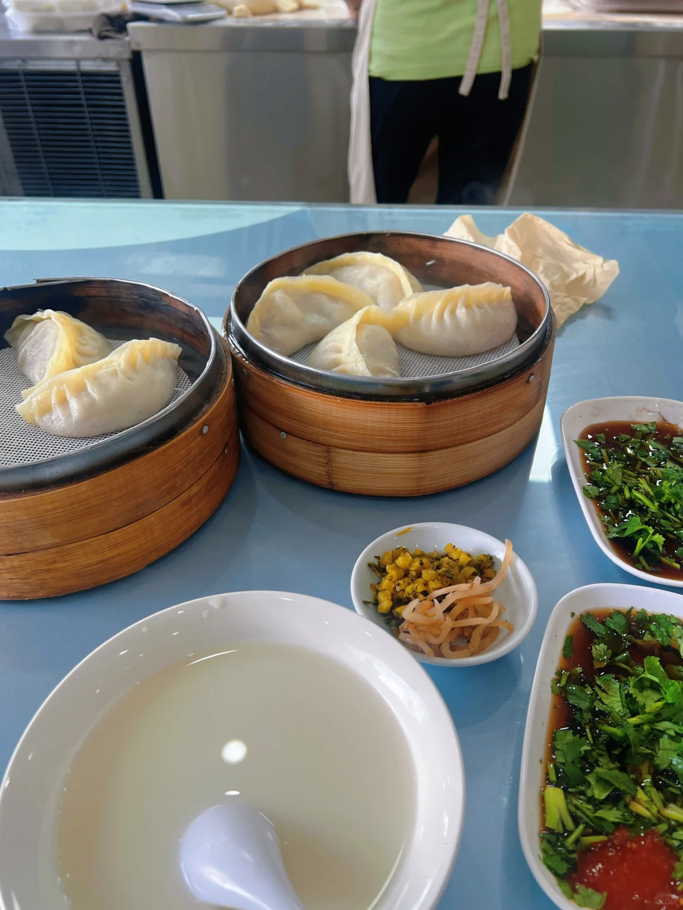

- 小红书：[📍东大街华姐灌汤蒸饺 · 小白](https://www.xiaohongshu.com/explore/6889910f0000000025012e0d)。清洁主帖公开链接实际打开暂时无法浏览需App扫码，站内搜索可读
- 点评：[具体门店](https://www.dianping.com/shop/G4j8gWrnRVuY5aMy)。正常淮安精确搜索唯一华姐取得店ID并亲开4.4/79条/16元，当前营业中06-10/16-20
- 高德：[地点](https://www.amap.com/place/B0KAPUM4VN)。正常SSR入口按可见城市UI选淮安，华姐清江浦陈华蒸饺店唯一同街结果，详情观察ID再亲开place4.6/2评价/15元，当前营业06-10/16-20
- 图像原文件 SHA256：cfae03fcf92073e0826cada83d37a247f39e7c7c17a452ef1e0eecc24b4d4e7d，1080×1440。竹蒸笼中蒸饺、粥和香菜蘸汁，闭合饺子外观不用于判断馅种。

## 淮安 · 老淮安·淮安菜

等级：exclude。专帖分店未知且高德门店营业未确认；完成采集但不进入优先推荐

- 小红书：[老淮安淮安菜~物美价廉的美味 · 行走的小风车](https://www.xiaohongshu.com/explore/69d9fe630000000021007063)。无参数打开显示当前笔记暂时无法浏览/App扫码；搜索入口正文可读
- 点评：[具体门店](https://www.dianping.com/shop/l5Yau3016997JjAt)。由真实相册页店名点击打开，店页可读；全部菜单评论App引导
- 高德：[搜索备选](https://www.amap.com/ssr/search?query=%E8%80%81%E6%B7%AE%E5%AE%89%2B%E5%91%A8%E6%81%A9%E6%9D%A5%E7%BA%AA%E5%BF%B5%E9%A6%86)。真实地点搜索结果可读但没有目标店结果
- 图像原文件 SHA256：1b0c00ec49d161d6b9d4a1ebd9b5350efa3e993a36c8db8461d4197ab743fd2a，1080×1440。本地查看实际为白碗豆腐羹/汤近景，正文明确点名平桥豆腐；画面不能单独识别分店或确证菜名，来源为本店专帖；下载元素不等同轮播顺序

## 淮安 · 淮安李记豆腐脑

等级：exclude。高德风控无法完成营业核对；保留候选资料不列优先推荐

- 小红书：[一定不可错过的中式甜品 · 没关注不许评论](https://www.xiaohongshu.com/explore/6a2d059d0000000021020655)。实际无签名打开当前笔记暂时无法浏览/App扫码；搜索入口可读
- 点评：[具体门店](https://www.dianping.com/shop/G2z4bGYnifArbBPV)。由实际索引相册shop链接，浏览器亲开可读店页
- 高德：[搜索备选](https://www.amap.com/search?query=%E6%B7%AE%E5%AE%89%E6%9D%8E%E8%AE%B0%E8%B1%86%E8%85%90%E8%84%91)。亲自正常地点搜索，出现滑块验证码，未解决或绕过
- 图像原文件 SHA256：1005ee3bf2962f82836235fc7c59efbcaec2281b5aace7b615f5dd0b438f482c，1080×1440。实际原图为淮安李记豆腐脑招牌与完整门面，右下平台水印保留。

## 淮安 · 南涟淮安菜

等级：caution。具体平台店铺位置与营业可读；但XHS分店与本地/近期负评证据不足，不列必去

- 小红书：[南涟 · Hallo](https://www.xiaohongshu.com/explore/6a6d7fd700000000260364f0)。真实无参数打开当前笔记暂时无法浏览/App扫码；搜索入口可读
- 点评：[具体门店](https://www.dianping.com/shop/58259761)。从芋颜相册附近商户真实链接取得，浏览器亲开可读店页
- 高德：[地点](https://www.amap.com/place/B0FFGK6WTM)。浏览器真实地点详情可读，营业中
- 图像原文件 SHA256：0ce788b3b62d83bb199c506f0c51ca2cbab729caa8600d8f4f02725157d46281，1440×1080。本地view_image核对为店内座位窗边与宝宝椅，墙上屏幕可见南涟品牌字样，对应本店环境；不能单独确定分店

## 淮安 · 南岳面馆

等级：caution。明确南门小街生活作者专帖与门头拼图实看，点评具体分店当前营业及部分近期评价可见；地图分段时间冲突、旧主张与低分全量缺口保留

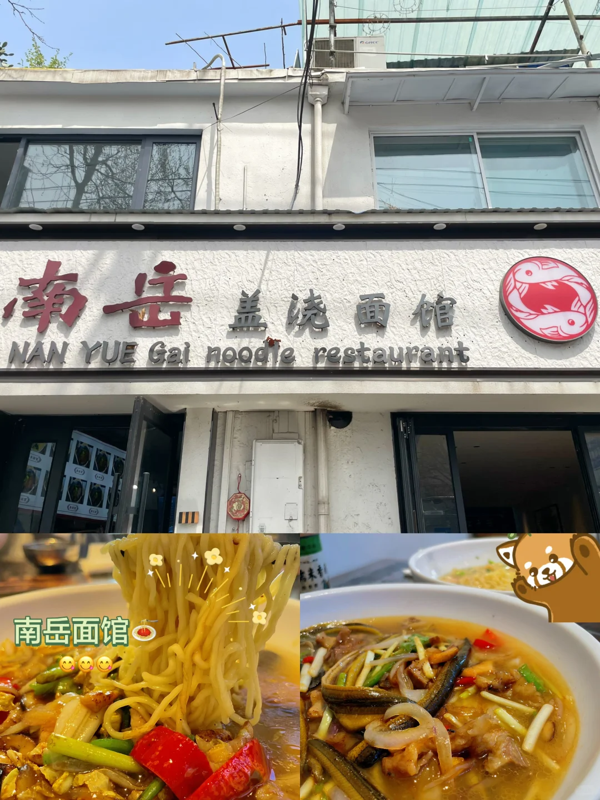

- 小红书：[这里的南岳面馆绝了！ · AKA阿静](https://www.xiaohongshu.com/explore/67ef5954000000001c02b436)。公开清洁主帖亲开当前笔记暂时无法浏览需App扫码，搜索原帖可读
- 点评：[具体门店](https://www.dianping.com/shop/G7uk91KbN7ehptyi)。正常淮安搜索3分店取得南门小街店，亲开4.0/224条/22元，营业中全天营业
- 高德：[地点](https://www.amap.com/place/B0FFFSBGCA)。亲开正常SSR搜索明确南门小街店，观察地点ID后亲开place可读4.5/8评价/28元、休息中分段营业
- 图像原文件 SHA256：a387e47fbdcc1317f0ad890bd005aa521d07026e8f4c8e3b291b80c98f38a0b2，1080×1440。原拼图上方南岳盖浇面馆店牌，下方汤面与浇头，原贴纸保留。

## 淮安 · 喷喷香砂锅

等级：caution。近期普通淮安生活作者乐园街砂锅原图，补充具名乐园喷喷香正文，两平台同19号1-01当前10:30-22:30营业；字序差异、环境分和近期低分缺口保留

- 小红书：[🎏淮安乐园街四件套今天少一套 · NmnZzz](https://www.xiaohongshu.com/explore/6ab949d5000000001402f70d)。清洁公开链接亲开当前笔记暂时无法浏览需App扫码，搜索入口可读
- 点评：[具体门店](https://www.dianping.com/shop/k4isJmPngWkAsPVE)。淮安搜索2结果取乐园步行街店，亲开4.0/57条/15元当前营业10:30-22:30
- 高德：[地点](https://www.amap.com/place/B0FFFZAZW8)。正常SSR亲开乐园店结果，详情观察ID再亲开place4.3/17元当前营业10:30-22:30
- 图像原文件 SHA256：4fee31ae8a42cdbea47e567aaeba314a9c40a5ba9f255cae83a8e65218e0bdf1，1440×1080。两只黑砂锅内粉丝、豆皮、青菜和肉酱，一锅香肠片；旁边串烧与饮品不归本店。

## 淮安 · 蒲鲜菜馆

等级：exclude。反向帖子有卫生指控待核实，且高德营业无法确认；保留研究记录不列优先推荐

- 小红书：[淮安美食4.0｜蒲鲜菜馆 · 苏婉的书](https://www.xiaohongshu.com/explore/689980b40000000025027e8d)。无参数实测跳404，当前笔记暂时无法浏览，App扫码；搜索签名入口正文可读
- 点评：[具体门店](https://www.dianping.com/shop/k36LUAH80qAqNNof)。浏览器店页实际可读评分地址菜品营业；完整评论引导App
- 高德：[搜索备选](https://www.amap.com/ssr/search?query=%E8%92%B2%E9%B2%9C%E8%8F%9C%E9%A6%86)。浏览器真实搜索可见1本店结果；未打开地点详情
- 图像原文件 SHA256：ffe66f89e48745255ceb3cfd65f203915a4cc538599efac65f9ec0a01be07971，1080×1440。本地原文件为一碗蒲菜肉圆菜汤，非门头；与蒲鲜专帖餐食对应。

## 淮安 · 施二馄饨专卖店

等级：caution。原图明确施二门头，电话13626189128及13952371882与高德西长街专卖店一致；点评和高德同两段营业，街号差异、偏咸和尺寸负向评论保留

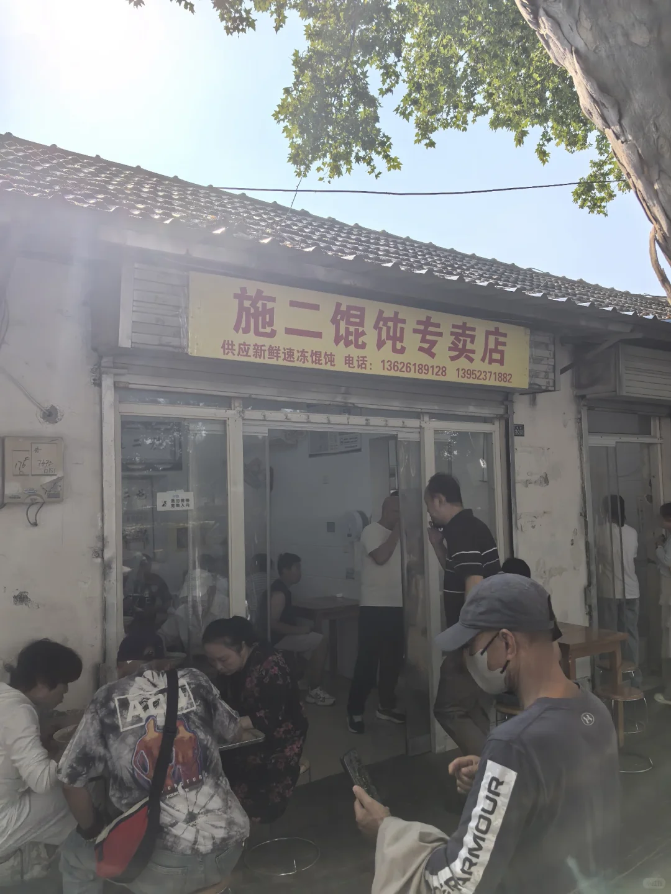

- 小红书：[淮安施二馄饨 · 慷慨的积木](https://www.xiaohongshu.com/explore/6aa5f36e0000000011036a61)。清洁canonical实际打开当前笔记暂时无法浏览，App扫码；站内搜索专帖可读
- 点评：[具体门店](https://www.dianping.com/shop/G7S2OcA6X5cPUyqC)。从实际淮安站内施二搜索3结果取得并亲开专卖店4.1/311条/10元，休息中两段营业，西长街134
- 高德：[地点](https://www.amap.com/place/B0FFHX5QAG)。实际切换城市淮安后站内施二搜索取得并亲开独立地点链接，4.6/6评价/16元，休息中05-10、16-19
- 图像原文件 SHA256：aac7c0f205c4e7b0ab07bbebd95043f4c4e0cdeded67cde5d8fc9f34abe4aa19，1080×1440。施二馄饨专卖店门头与两公开店电话清楚，可与平台核对；店内就餐环境实拍。

## 淮安 · 苏淮孙家面馆

等级：caution。专帖明确小康城，地图位置及国庆营业时间可读；点评分店未匹配与近期评价不足

- 小红书：[淮安 | 孙家面馆 · 热水壶](https://www.xiaohongshu.com/explore/6816dc7c0000000009016351)。无签名实际打开当前笔记暂时无法浏览/App扫码，搜索入口正文可读
- 点评：[具体门店](https://www.dianping.com/shop/G4vmGzS5ySIohVME)。真实相册链接门店亲开可读，但淮海第一城店与XHS小康城不是一店
- 高德：[地点](https://www.amap.com/place/B02050SWCW)。浏览器地点详情亲开可读小康城总部地址及国庆营业时间
- 图像原文件 SHA256：37511e3303bdc8c5b178b5ca4716dc46f5386e7af02fec612da16422dec98ea6，960×1280。本地view_image核为两碗肉蔬菜浇头面，碗沿苏淮孙家/孙家面馆字样，正文叉烧拆骨面与本店匹配

## 淮安 · 唐士功臭干

等级：caution。普通生活作者专帖、实拍菜和门头与同电话高德利苑店吻合；上海路补充帖、点评具体分店当前16时营业，高德16-23；门牌差异/点评3.8/近期低分缺口保留

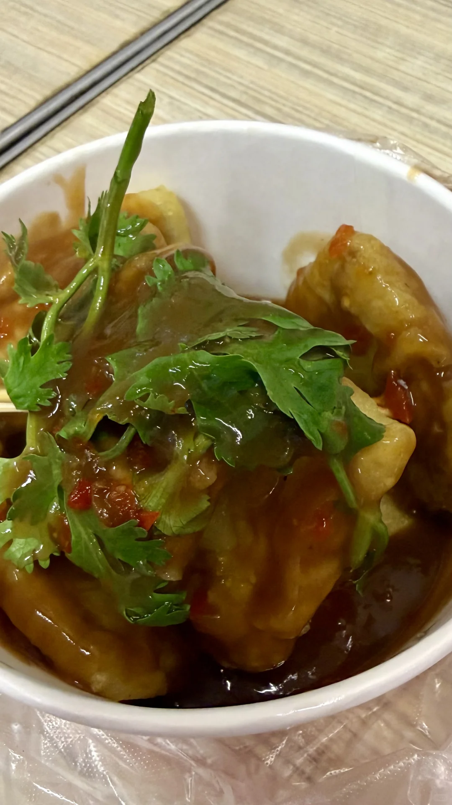

- 小红书：[淮安唐士功臭干 · 老皮皮小颖](https://www.xiaohongshu.com/explore/6a7d9ffc0000000006006bc3)。公开canonical实际打开当前笔记暂时无法浏览/App扫码；站内搜索主帖可读
- 点评：[具体门店](https://www.dianping.com/shop/G7xNrwJHDAbBfxZy)。实际淮安站内搜索2结果取得上海路店并亲开3.8/65条/10元，休息中16:00开始营业
- 高德：[地点](https://www.amap.com/place/B0FFJ7NF0P)。实际同一SSR搜索入口唐士功上海路正常出现利苑2区店，取得地点ID并亲开清洁place，4.2/13元，休息中16-23
- 图像原文件 SHA256：5b0bbb6b8fd321d8e9a592d99413c7451cd93b2b23dc2331b812a7f5d580f4f8，1080×1920。白碗扁臭干配棕色酱汁香菜，符合白色扁臭干正文；分店由同帖辅助门头及电话支持。

## 淮安 · 谭记小吃

等级：caution。驸马巷专帖实际阅读及原图，作者普通生活/淮安倾向，点评同分店营业中06-21；高德阻断和近期低分缺口保留，不列必去

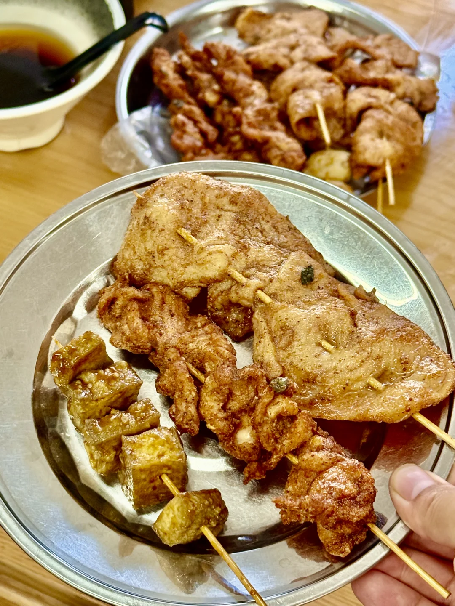

- 小红书：[住在驸马巷里的谭记小吃 · 发现美味的阿联酋](https://www.xiaohongshu.com/explore/6a7744f800000000050306ea)。清洁公开链接实际打开当前笔记暂时无法浏览，需App扫码；搜索入口正文可读
- 点评：[具体门店](https://www.dianping.com/shop/lazo8xTUG7sm9vkM)。实际淮安站内搜索7结果，亲开明清商业步行街店，4.0/580条/30元，营业中06-21
- 高德：[搜索备选](https://www.amap.com/ssr/search?query=%E6%B7%AE%E5%AE%89%E8%B0%AD%E8%AE%B0%E5%B0%8F%E5%90%83%E9%A9%B8%E9%A9%AC%E5%B7%B7)。实际亲开搜索入口无门店结果，切城市控件显示滑块验证，未操作验证
- 图像原文件 SHA256：708f3e076a460885983a37b5312e9b10ec750f61266141b2118db121b14e9488，1080×1440。两盘竹签炸串及酱汁碗，匹配驸马巷谭记具名正文，不以外观判断具体肉品。

## 淮安 · 文楼·淮扬菜·淮安早茶

等级：caution。同分店XHS原图明确北门店，两平台地址及今日营业时段可读；口味服务分歧、近期评价缺口，不能必去

- 小红书：[淮安随便进的一家店，居然超预期❗️ · 美杜莎的谜](https://www.xiaohongshu.com/explore/695b0c7e000000001e006e92)。实际无签名打开当前笔记暂时无法浏览/App扫码；搜索专帖正文可读
- 点评：[具体门店](https://www.dianping.com/shop/584233)。亲开北门店4.0/1320条/63元，休息中并显示当天三段营业时段
- 高德：[地点](https://www.amap.com/place/B020505EZH)。亲开北门店地址、休息中营业时段和26条评价；晚餐结束时间与点评冲突
- 图像原文件 SHA256：c406dd14a1ad92b42e8a39f38e398b93a194d3357837233b605d37ea20e68f4b，1080×1440。root实看原文件为白盘切块带骨肉，本文作者称盐水鹅；上方作者文字明确文楼早茶淮扬菜（北门大街店），食品实拍与专帖匹配，保留原作者文字与完整原图。
